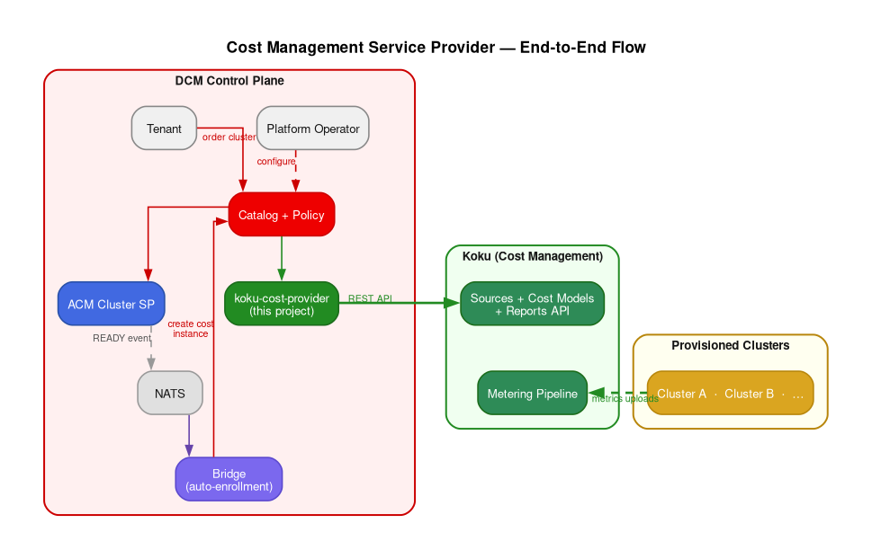

# Cost Management Service Provider for DCM

A [DCM](https://dcm-project.github.io/) service provider that integrates
[Red Hat Lightspeed Cost Management](https://github.com/project-koku/koku)
(Project Koku) with DCM's provisioning lifecycle. When DCM provisions
infrastructure, this service provider automatically creates the corresponding
Koku sources and cost models — so metering and cost tracking begin without
manual configuration.

Implemented in Go. API-first (OpenAPI 3.0.4). Uses DCM's standard service
provider contract — the same `POST` / `DELETE` / CloudEvent lifecycle as any
other provider.

## Architecture Overview



When a tenant orders a cluster through DCM, the ACM Cluster SP provisions it
and publishes a READY event to NATS. A bridge component picks up the event,
selects a cost profile based on cluster labels, and creates a cost instance
through DCM's catalog pipeline. The `koku-cost-provider` (this project)
receives the request, creates the Koku source and cost model via Koku's REST
API, and a background reconciler monitors readiness. Once the metrics operator
uploads data and Koku processes it, the instance transitions to READY.

## Key Concepts

**Three tiers of visibility**, each building on the previous:

1. **Basic Metering** — CPU, memory, and storage utilization/capacity. No cost
   model needed.
2. **Metering + Distribution** — Tier 1 plus overhead categorization (control
   plane, platform projects, worker unallocated, storage/GPU/network) distributed
   across tenant projects.
3. **Full Cost** — Tier 2 plus a price list with 40+ cost dimensions. Every
   metric becomes a billable quantity: `cost = metering × rate`.

**Operator-first.** The platform operator configures cost profiles and policies
once. The bridge watches for new clusters and automatically creates cost
instances through DCM's catalog. Tenants consume metering and cost data
read-only.

**No special plumbing.** The cost SP uses DCM's existing SP contract. Koku's
REST API handles metering storage, cost calculation, rate application,
distribution, and reporting.

## Project Structure

```
cmd/koku-cost-provider/     Entry point (main.go)
internal/
  apiserver/                HTTP server, middleware (OpenAPI validation, body limits, RFC 7807)
  config/                   Environment-based configuration
  handler/                  SP contract implementation (create / get / list / delete)
  health/                   Health checker with Koku probe caching
  koku/                     Koku REST API client
  monitoring/               CloudEvent publisher (NATS)
  reconciler/               Background loop: PROVISIONING → READY
  registration/             SP self-registration with DCM
  store/                    SQLite persistence (GORM)
api/v1alpha1/               OpenAPI spec + generated types
internal/api/server/        Generated strict server interface
pkg/client/                 Generated Go client
docs/                       Architecture docs, design docs, white paper, diagrams
```

## Getting Started

### Prerequisites

- Go 1.25+
- A running Koku instance (or Red Hat Lightspeed Cost Management)
- NATS server
- DCM control plane (for registration)

### Build and Run

```bash
make build                  # → bin/koku-cost-provider
make test                   # run tests with -race
make container-build        # podman build using Containerfile
```

### Configuration

All configuration is via environment variables:

| Variable | Required | Default | Description |
|----------|----------|---------|-------------|
| `KOKU_API_URL` | yes | — | Koku API base URL |
| `KOKU_IDENTITY` | * | — | Base64-encoded `x-rh-identity` header |
| `KOKU_IDENTITY_FILE` | * | — | Path to file containing the identity (preferred over env var) |
| `SP_ENDPOINT` | yes | — | Public URL of this service provider |
| `DCM_REGISTRATION_URL` | yes | — | DCM SPRM registration endpoint |
| `SP_NATS_URL` | yes | — | NATS server URL |
| `SP_NAME` | no | `koku-cost-provider` | Provider name for registration |
| `SP_DISPLAY_NAME` | no | — | Human-readable display name |
| `SP_SERVER_ADDRESS` | no | `:8080` | HTTP listen address |
| `SP_SERVER_MAX_BODY_SIZE` | no | `1048576` | Max request body (bytes) |
| `SP_DB_PATH` | no | `data/cost-provider.db` | SQLite database path |
| `SP_RECONCILER_POLL_INTERVAL` | no | `5m` | How often the reconciler checks instances |
| `SP_RECONCILER_PROVISION_TIMEOUT` | no | `24h` | Max time before marking instance as failed |

\* One of `KOKU_IDENTITY` or `KOKU_IDENTITY_FILE` must be set.

## Development

```bash
make generate-api           # regenerate types, server, and client from OpenAPI spec
make check                  # fmt + vet + lint + test
make lint                   # golangci-lint
make tidy                   # go mod tidy
```

CI runs on every push and PR (`test`, `lint`, `generate-check`). See
[`.github/workflows/ci.yaml`](.github/workflows/ci.yaml).

## Design Documents

| Document | Description |
|----------|-------------|
| [DCM Architecture and Integration Guide](docs/DCM-Architecture-and-Integration-Guide.md) | Comprehensive reference on DCM's architecture: service providers, catalog model, policy engine, communication patterns, and provisioning lifecycle. |
| [Cost Management + DCM Integration Architecture](docs/Cost-Management-DCM-Integration-Architecture.md) | How Koku's data pipeline and cost models map to DCM's provisioning events. Covers the NATS-to-Koku bridge, data mapping, operator deployment strategy, and phased delivery plan. |
| [Cost Service Provider Design](docs/Cost-Service-Provider-Design.md) | The full service provider proposal: `cost` service type, three-tier model (basic metering → distribution → full cost), catalog items, operator-first workflows, Rego policies, and the `koku-cost-provider` microservice design. |
| [Metering and Cost Management for Sovereign Clouds](docs/Metering-and-Cost-Management-for-Sovereign-Clouds.md) | White paper: why sovereign cloud providers need on-premise metering and cost management, and how this architecture delivers it. Also available as [DOCX](docs/Metering-and-Cost-Management-for-Sovereign-Clouds.docx) and [PDF](docs/Metering-and-Cost-Management-for-Sovereign-Clouds.pdf). |

## Related Projects

- **[Project Koku](https://github.com/project-koku/koku)** — Cost Management backend (Django, Celery, PostgreSQL)
- **[koku-metrics-operator](https://github.com/project-koku/koku-metrics-operator)** — OpenShift operator that collects Prometheus metrics and uploads to Koku
- **[DCM](https://dcm-project.github.io/)** — Data Center Management control plane

## License

Apache License 2.0
