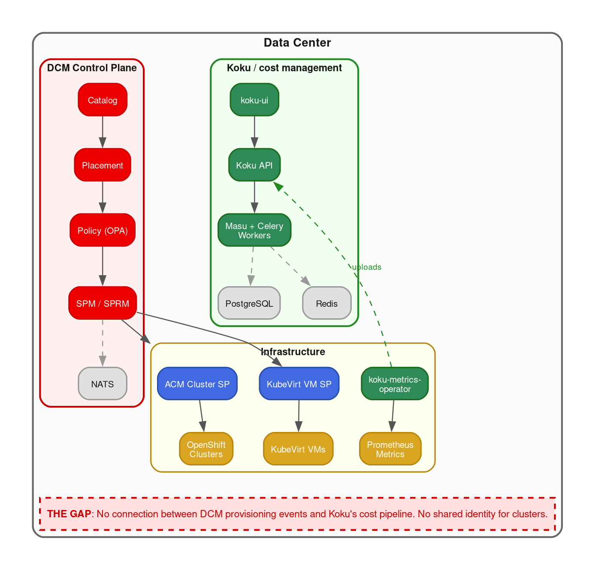
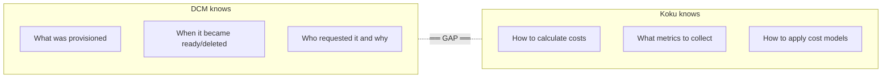
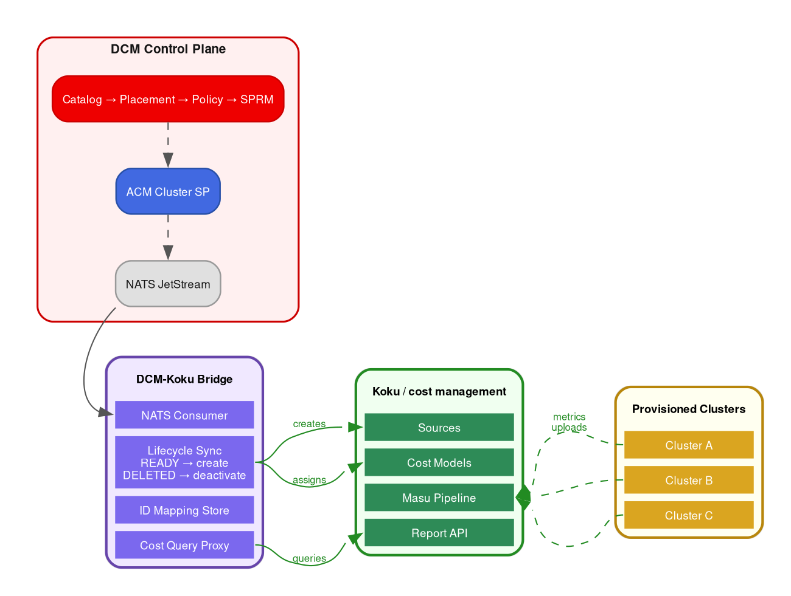
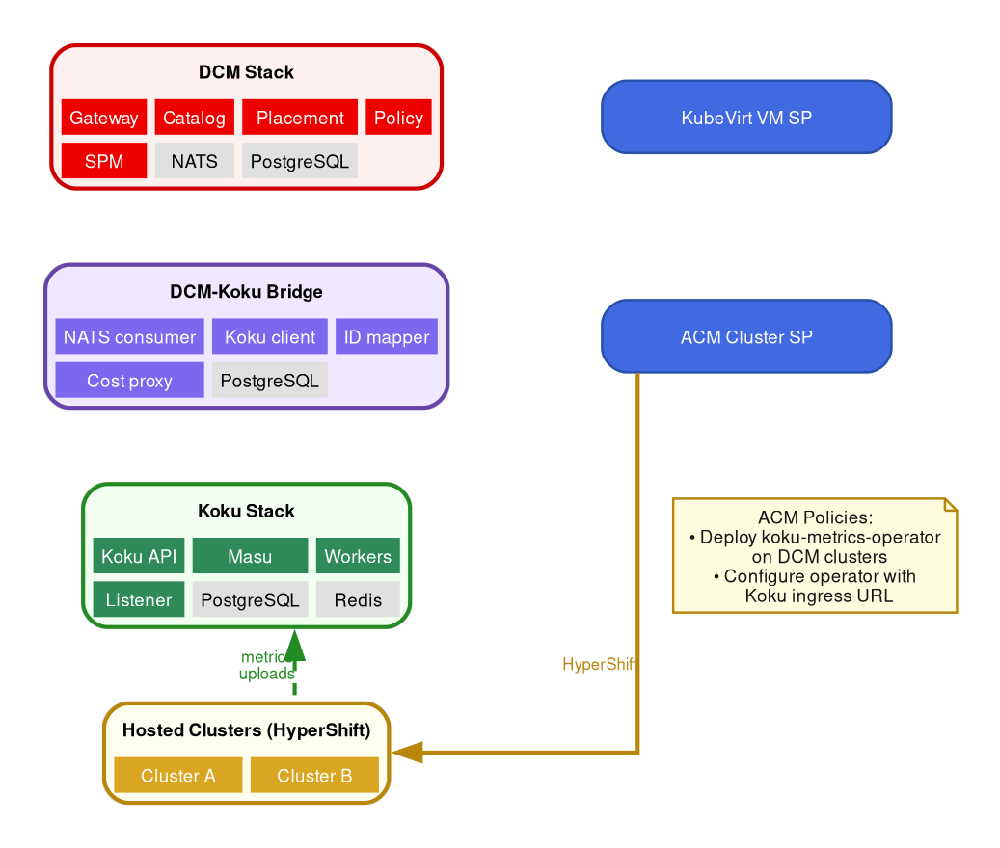

# Cost Management + DCM Integration Architecture

## Bridging Koku/Cost Management with DCM Service Providers

**Version:** 1.2
**Date:** 2026-04-17
**Prerequisites:** [DCM Architecture and Integration Guide](./DCM-Architecture-and-Integration-Guide.md)

---

## Table of Contents

1. [Executive Summary](#1-executive-summary)
2. [Problem Statement](#2-problem-statement)
3. [System Landscape](#3-system-landscape)
4. [How Koku Works Today](#4-how-koku-works-today)
5. [How DCM Works Today](#5-how-dcm-works-today)
6. [The Integration Gap](#6-the-integration-gap)
7. [Integration Architecture Options](#7-integration-architecture-options)
8. [Recommended Architecture: Option C — Hybrid Bridge](#8-recommended-architecture-option-c--hybrid-bridge)
9. [Data Mapping: DCM to Koku](#9-data-mapping-dcm-to-koku)
10. [Communication Bridge: NATS to Koku Pipeline](#10-communication-bridge-nats-to-koku-pipeline)
11. [Cost Service Provider for DCM](#11-cost-service-provider-for-dcm)
12. [Policy Integration](#12-policy-integration)
13. [Deployment Topology](#13-deployment-topology)
14. [Open Questions and Trade-offs](#14-open-questions-and-trade-offs)
15. [Phased Delivery Plan](#15-phased-delivery-plan)

---

## 1. Executive Summary

This document designs the integration between **DCM** (Data Center Management)
and **Koku/Cost Management** (the open-source FinOps engine upstream of Red Hat
Lightspeed Cost Management).

The goal: when DCM provisions infrastructure (clusters, VMs, containers), Cost
Management should automatically track, rate, and report the costs — without
requiring the end user to manually configure sources, install operators, or
manage cost models separately.

The integration must work in **on-premises** deployments where both DCM and Koku
run in the same data center, using PostgreSQL-only paths (no Trino).

### Key Assumption: One Koku, Many Clusters

A single Koku instance inherently serves **multiple OpenShift clusters**. Each
cluster is a separate `Provider/Source` record, with its own
koku-metrics-operator uploading hourly data. Koku already aggregates costs
across clusters, namespaces, pods, PVCs, and OpenShift Virtualization VMs
within each cluster.

This means the integration bridge is **not** a per-cluster component. It is a
**singleton** that manages the mapping between DCM's provisioned resources and
Koku's multi-cluster cost data. For VMs and containers provisioned on clusters
that already have the metrics operator, Koku is **already tracking their costs**
— the bridge only needs to provide ID correlation, not trigger new data
collection.

### Architecture Note: Multi-Architecture Support

The Koku pipeline supports clusters running on x86-64, ARM, IBM Z, LinuxOne,
and POWER with identical data flow — the koku-metrics-operator, CSV format,
ingestion pipeline, and cost model application are architecture-agnostic. The
DCM integration bridge inherits this coverage automatically; no special
handling is required for non-x86 clusters.

---

## 2. Problem Statement

Today, Koku and DCM operate in completely separate worlds:

| Aspect | Koku | DCM |
|--------|------|-----|
| **Knows about infra** | Only after operator uploads metrics | At provisioning time |
| **Lifecycle events** | Discovers clusters reactively | Orchestrates them proactively |
| **Cost models** | Manual admin setup per source | No concept of cost |
| **Status** | No provisioning awareness | Tracks PENDING→READY→DELETED |
| **Messaging** | Kafka (upload pipeline) + Celery | NATS JetStream (CloudEvents) |
| **Cross-service** | Standalone | Hub-and-spoke, no SP↔SP |

**The core tension:** DCM knows *what* was provisioned and *when*, but not *what
it costs*. Koku knows *how to calculate costs* but not *what DCM provisioned*.
Neither system talks to the other.

---

## 3. System Landscape



---

## 4. How Koku Works Today

### Data Ingestion (OCP Path)

1. **koku-metrics-operator** runs on each OpenShift cluster
2. Queries **Prometheus/Thanos** every hour for node, pod, storage, namespace,
   VM, and GPU metrics (on clusters running x86-64, ARM, IBM Z, LinuxOne,
   or POWER — the operator and pipeline are architecture-agnostic)
3. Generates **CSV files** (pod usage, storage usage, node labels, namespace
   labels, VM usage, GPU usage)
4. Packages CSVs + `manifest.json` into a **tar.gz**
5. Uploads to the **ingress** endpoint (content-type:
   `application/vnd.redhat.hccm.tar+tgz`)
6. Koku's **Kafka listener** (or dev HTTP endpoint) downloads and extracts
7. CSVs are processed into **line item tables** (PostgreSQL on-prem, or Parquet
   on S3 + Trino for cloud)
8. **Summary tables** aggregate usage data
9. **Cost model** rates are applied (usage costs, tag costs, monthly costs,
   markup, distribution)
10. **UI summary tables** are populated for the API

### Key CSV Columns (Pod Usage)

```
report_period_start, report_period_end, interval_start, interval_end,
node, namespace, pod,
pod_usage_cpu_core_seconds, pod_request_cpu_core_seconds, pod_limit_cpu_core_seconds,
pod_usage_memory_byte_seconds, pod_request_memory_byte_seconds, pod_limit_memory_byte_seconds,
node_capacity_cpu_cores, node_capacity_cpu_core_seconds,
node_capacity_memory_bytes, node_capacity_memory_byte_seconds,
node_role, resource_id, pod_labels
```

### Cost Model Application Order

1. **Usage costs** — tiered rates × usage quantities (CPU, memory, volume,
   node/cluster hourly)
2. **VM usage costs** — VM-specific hourly rates
3. **Markup** — `infrastructure_raw_cost × markup_percentage`
4. **Monthly costs** — node/cluster/PVC/VM monthly lump sums, distributed by
   usage share
5. **Tag-based costs** — rates keyed by label key:value pairs
6. **Distribution** — platform, worker, storage, network, GPU overhead
   redistributed to user projects
7. **UI summary population** — aggregated into partitioned summary tables

Across these steps, Koku supports more than **40 cost dimensions** — from CPU
core-hours (usage, request, effective) and memory GB-hours to node-months,
cluster-months, VM core-hours, PVC-months, project-months, and GPU (physical
devices and NVIDIA MIG) — with every metric parameterizable by tag.

### What Koku Needs Per Cluster

To calculate costs for an OpenShift cluster, Koku requires:

- A **Provider/Source** record with a stable `cluster_id`
- A **CostModel** linked via **CostModelMap** (rates, markup, distribution config)
- **Hourly usage data**: pod CPU/memory, node capacity, PVC storage, namespace
  labels, optionally VM and GPU data
- For **OCP-on-cloud**: infrastructure raw costs from the cloud provider
  (AWS CUR, Azure exports, GCP BigQuery)

These requirements apply regardless of cluster architecture (x86-64, ARM,
IBM Z, LinuxOne, POWER) — the pipeline is identical for all platforms.

> **Cloud cost management.** Beyond on-premise OpenShift, Koku also supports
> cloud costs on Amazon Web Services, Microsoft Azure, and Google Cloud — any
> cloud service, including private offers and managed OpenShift (ROSA — Red Hat
> OpenShift on AWS — and ARO — Azure Red Hat OpenShift). For ROSA and ARO, the
> cost of OpenShift subscriptions is automatically factored in and distributed
> to workloads. While DCM integration focuses on the on-premise use case, the
> same Koku instance can provide a unified cost view across on-premise and
> cloud infrastructure for hybrid sovereign environments.

> **Fine-grained RBAC.** Koku's role-based access control allows the provider
> to aggregate all clusters, VMs, namespaces, and projects in a single
> instance while restricting what each user — or each sovereign cloud tenant —
> can see and do. A tenant given read access sees only their own namespaces
> and costs, never another tenant's data. This is the mechanism that makes
> tenant self-service cost visibility safe in a multi-tenant sovereign
> environment.

---

## 5. How DCM Works Today

### Cluster Provisioning Flow

1. User orders from **Catalog** (e.g., "Production Cluster" catalog item)
2. **Placement Manager** stores intent, evaluates **policies** (OPA/Rego)
3. **SPRM** forwards to **ACM Cluster SP**
4. SP creates `HostedCluster` + `NodePool` on ACM hub
5. SP monitors conditions, publishes **CloudEvents** to NATS
6. SPM stores status: `PENDING → PROVISIONING → READY → DELETED`

### What DCM Knows at Provisioning Time

| Data Point | Where in DCM | Relevance to Cost |
|------------|-------------|-------------------|
| Cluster name | `spec.metadata.name` | Maps to Koku `cluster_alias` |
| Instance ID | `dcm-instance-id` label | Stable cross-system correlator |
| K8s version | `spec.version` | Version-specific pricing |
| Worker count | `spec.nodes.workers.count` | Capacity baseline |
| Worker CPU/memory/storage | `spec.nodes.workers.*` | Resource sizing |
| Platform (kubevirt/baremetal) | `provider_hints.acm.platform` | Affects cost model choice |
| Provider name | Registration `name` | Multi-SP cost attribution |
| Lifecycle status | CloudEvents on NATS | Cost start/stop dates |
| Labels | `spec.metadata.labels` | Tag-based cost allocation |

### What DCM Does NOT Know

- Actual runtime usage (CPU utilization, memory pressure, pod counts)
- Infrastructure costs from underlying cloud providers
- Cost rates or financial models
- Historical usage trends

---

## 6. The Integration Gap



### Specific gaps:

1. **No shared cluster identity** — DCM's `dcm-instance-id` ≠ Koku's
   `cluster_id` (which is the OpenShift cluster's actual cluster ID)
2. **No automatic source creation** — Koku requires a Provider/Source record;
   nobody creates it when DCM provisions a cluster
3. **No operator deployment** — The metrics operator must be installed on each
   cluster to feed Koku; DCM doesn't do this
4. **No cost model assignment** — Even if data flows, Koku needs a CostModel
   linked to the source
5. **No lifecycle synchronization** — When DCM deletes a cluster, Koku doesn't
   know to stop expecting data or to mark the source inactive
6. **Different messaging systems** — DCM uses NATS, Koku uses Kafka + Celery;
   no shared bus

### What is NOT a gap (if the operator is already running):

- **Multi-cluster cost tracking** — Koku already handles many clusters in a
  single instance; each cluster is a separate Source.
- **VM cost tracking within a cluster** — Once the metrics operator runs on a
  cluster, it captures ALL pods including KubeVirt VMs (via
  `vm_kubevirt_io_name` labels). If DCM's KubeVirt SP provisions a VM on a
  cluster that already has the operator, **Koku is already pricing that VM**.
- **Container cost tracking within a cluster** — Same principle. Deployments
  created by DCM's K8s Container SP are captured automatically by the operator.
- **Namespace-level cost attribution** — Koku already breaks down costs by
  namespace, node, and project. No new pipeline work is needed.
- **Cost distribution** — Platform, worker, storage, network, and GPU overhead
  distribution is built into Koku's cost model system and works across all
  workloads on a cluster regardless of how they were provisioned.

### How Koku collects data: full-cluster, every hour

The koku-metrics-operator is a **cluster-scoped** collector. It queries
Prometheus for every node, pod, PVC, namespace, and VM on the cluster every
hour and uploads the **entire cluster's** usage data. There is no mode to
collect data for a single VM or namespace in isolation.

This is the expected model — the goal is **full-cluster cost visibility**:

1. **Every DCM-provisioned cluster gets the operator** as part of the standard
   onboarding flow. The bridge ensures the operator is deployed and a Koku
   Source is created as soon as the cluster reaches READY.

2. **Cost data granularity comes from filtering, not targeted collection.**
   To answer "how much does DCM VM X cost?", the bridge queries Koku's full
   cluster dataset (e.g., `reporting_ocp_vm_summary_p`) and filters by
   `vm_name` + `cluster_id`. The full cluster's data is always ingested —
   that's how we get cost visibility for everything on the cluster.

3. **Pipeline cost scales with cluster size.** A 500-namespace cluster means
   Koku processes all 500 namespaces' data every hour, regardless of how many
   resources DCM provisioned. This is a capacity planning consideration, not a
   problem — it's the same data pipeline used by all Red Hat Cost Management
   deployments.

4. **Sequencing matters for new clusters.** After DCM provisions a new cluster:
   cluster READY → operator deployed via ACM Policy (~minutes) → operator
   collects the previous completed UTC hour from Prometheus (immediate) →
   packages and uploads tar.gz (seconds) → Koku Celery pipeline processes
   (minutes). **First cost data is typically available ~10-15 minutes after the
   operator starts.** The worst case is longer only if the operator deployment
   itself is slow (OLM subscription + install on a fresh cluster).

5. **Pre-existing clusters (edge case).** This architecture assumes all clusters
   are provisioned by DCM. In the theoretical case where DCM service providers
   target clusters created outside of DCM, those clusters would need the
   metrics operator installed and a Koku Source created separately. There is no
   conflict risk: Koku identifies sources by the OpenShift `cluster_id` UUID
   (from the ClusterVersion CR), so a pre-existing Koku Source for the same
   cluster simply matches on the same UUID.

---

## 7. Integration Architecture Options

### Option A: DCM-Unaware (Operator-Only)

```
DCM provisions cluster → Admin manually installs koku-metrics-operator
                        → Admin manually creates Koku source + cost model
                        → Operator uploads data → Koku processes
```

**Pros:** No code changes. Works today.
**Cons:** Fully manual. No lifecycle sync. DCM and Koku are islands.
No value-add from integration.

### Option B: DCM as Koku Data Source (Push Model)

```
DCM provisions cluster → DCM calls Koku API to create Source
                        → DCM deploys operator on new cluster
                        → Operator uploads to Koku normally
                        → DCM lifecycle events update Koku source status
```

**Pros:** Leverages existing Koku pipeline. Minimal Koku changes.
**Cons:** DCM must understand Koku's API. Tight coupling. DCM becomes
responsible for operator deployment (out of scope for current SP model).

### Option C: Hybrid Bridge (Recommended)

```
DCM provisions cluster → Bridge service watches NATS for DCM events
                        → Bridge creates Koku Source + CostModel
                        → Bridge triggers operator deployment (via ACM policy)
                        → Operator uploads to Koku normally
                        → Bridge syncs lifecycle (READY/DELETED → Source active/inactive)

For cost queries:
User asks DCM "how much does my cluster cost?"
  → Cost SP queries Koku API
  → Returns cost data through DCM's standard SP response
```

**Pros:** Loose coupling. Each system does what it's best at. Koku's proven
pipeline handles actual cost calculation. Bridge is a focused translation layer.
**Cons:** New component to build and maintain.

### Option D: Cost as a DCM Service Provider

```
DCM provisions cluster → Normal DCM flow
                        → Cost SP subscribes to NATS dcm.cluster subject
                        → On READY: creates Koku source, deploys operator
                        → On cost query: wraps Koku API
                        → On DELETED: deactivates source
```

**Pros:** Fits DCM's SP model natively. Discoverable through DCM registry.
**Cons:** Stretches the SP concept (cost SP doesn't "provision" anything in the
traditional sense). Status events are one-directional in current DCM.

### Option E: Full Cost SP (Koku Embedded)

```
Cost SP receives cluster spec from DCM
  → Runs its own metrics collection (embeds Prometheus queries)
  → Applies cost models internally
  → Returns cost data as SP response
  → No dependency on Koku at all
```

**Pros:** Self-contained. No Koku dependency.
**Cons:** Reimplements most of Koku. Massive scope. Loses Koku's mature
cost model, distribution, and reporting features.

---

## 8. Recommended Architecture: Option C — Hybrid Bridge

The recommended approach combines a **bridge service** for lifecycle
synchronization with a **cost service provider** for DCM-native cost queries.



---

## 9. Data Mapping: DCM to Koku

### Identity Mapping

| DCM Concept | Koku Concept | Mapping Strategy |
|-------------|-------------|------------------|
| `dcm-instance-id` (UUID on HostedCluster label) | `cluster_id` (OpenShift cluster ID from ClusterVersion CR) | Bridge maintains a mapping table. The actual `cluster_id` is only known after the cluster is READY (read from the provisioned cluster). |
| `spec.metadata.name` | `cluster_alias` (Provider name in Koku) | Direct mapping. |
| DCM provider name (e.g., `acm-cluster-sp-prod`) | Koku `Provider.type = OCP` | All DCM-provisioned OCP clusters become `PROVIDER_OCP` sources in Koku. |
| `spec.metadata.labels` | Koku tag-based rates / cost categories | Labels flow through the metrics operator as `namespace_labels` and `pod_labels`. DCM labels on the cluster spec could be added as default namespace labels by the bridge. |
| DCM catalog item ID | (no equivalent) | Could be stored in Koku Provider `additional_context` or as a label for grouping. |

### Lifecycle Mapping

| DCM Status (CloudEvent) | Koku Action |
|--------------------------|-------------|
| `PENDING` | No action (cluster not yet usable) |
| `PROVISIONING` | No action (no metrics yet) |
| `READY` | Create Source, assign CostModel, trigger operator install |
| `UNAVAILABLE` | Mark source as paused (stop expecting data) |
| `DELETED` | Deactivate source, finalize cost data |

### Resource Spec Mapping (for cost model selection)

| DCM Cluster Spec | Relevance to Cost Model |
|-------------------|------------------------|
| `nodes.workers.count` | Determines expected node count for node monthly rates |
| `nodes.workers.cpu` | Drives CPU tiered rate selection |
| `nodes.workers.memory` | Drives memory tiered rate selection |
| `nodes.workers.storage` | Drives volume rate selection |
| `provider_hints.acm.platform` (kubevirt/baremetal) | Different cost profiles: KubeVirt has VM overhead; baremetal has hardware costs |
| `version` (K8s) | May affect rate tiers or cost model version |

---

## 10. Communication Bridge: NATS to Koku Pipeline

### NATS Consumer (DCM Side)

The bridge subscribes to NATS JetStream subjects that DCM SPs publish to.
Since all clusters are provisioned by DCM, the bridge controls the full
lifecycle: every cluster gets a Koku Source and the metrics operator as part of
the standard onboarding flow.

| Subject | Event Type | Bridge Action |
|---------|-----------|---------------|
| `dcm.cluster` | `dcm.status.cluster` | **Onboard:** Create Koku Source, deploy metrics operator via ACM Policy, assign cost model |
| `dcm.vm` | `dcm.status.vm` | **Correlate:** Store DCM resource ID → Koku `cluster_id` + `vm_name` mapping |
| `dcm.container` | `dcm.status.container` | **Correlate:** Store DCM resource ID → Koku `cluster_id` + `namespace` + `pod` mapping |

For VMs and containers, the hosting cluster is always already onboarded (it was
provisioned by DCM first). The bridge simply records the ID mapping so that
cost queries can filter Koku's cluster-wide data to the specific resource.

The koku-metrics-operator collects the **entire cluster's** data every hour —
all nodes, pods, PVCs, namespaces, and VMs. Cost queries for individual DCM
resources work by **filtering** from this full dataset. This is by design: the
goal is full-cluster cost visibility, with per-resource drill-down as an
additional capability.

> **Edge case:** If DCM ever targets clusters created outside of DCM, those
> clusters would need the operator installed and a Koku Source created. There is
> no conflict risk — Koku matches sources by the OpenShift `cluster_id` UUID,
> so duplicate creation attempts simply match the existing Source.

### CloudEvent to Koku Action Translation

The bridge processes CloudEvents with this data structure:

```json
{
  "data": {
    "id": "dcm-instance-uuid",
    "status": "READY",
    "message": "Cluster is ready and all nodes are available"
  }
}
```

**On `READY`:**

1. Query DCM's SPM for the full instance details:
   `GET /api/v1alpha1/service-type-instances/{id}`
2. Query the provisioned cluster (via kubeconfig from ACM) for the real
   `cluster_id` (from `ClusterVersion` CR)
3. Store the mapping: `dcm_instance_id ↔ cluster_id`
4. Call Koku API: `POST /api/cost-management/v1/sources/` to create a Provider
5. Assign a CostModel (based on DCM catalog item, platform, or default)
6. Trigger operator deployment on the new cluster (via ACM policy or
   ManagedClusterAction)

**On `DELETED`:**

1. Look up `cluster_id` from mapping table
2. Call Koku API to deactivate the source (set `paused=True` or delete)
3. Optionally: finalize cost data, generate final cost report

### Koku API Calls (Bridge → Koku)

The bridge uses Koku's existing REST API:

```
POST /api/cost-management/v1/sources/
  → Create OCP source with cluster_id and authentication

POST /api/cost-management/v1/cost-models/
  → Create or assign cost model to the new source

PATCH /api/cost-management/v1/sources/{uuid}/
  → Update source status (paused, active)

GET /api/cost-management/v1/reports/openshift/costs/
  → Query cost data for the cost service provider responses
```

### Operator Deployment Strategy

The metrics operator must run on each provisioned cluster. Options:

| Strategy | How | Complexity |
|----------|-----|------------|
| **ACM Policy** (recommended) | ACM PolicySet that auto-deploys the operator to clusters labeled `dcm.project/managed-by=dcm` | Low — leverages ACM's built-in governance. Bridge just ensures the label exists (already set by ACM Cluster SP). |
| **ManagedClusterAction** | Bridge directly creates a ManagedClusterAction CR on the hub to install the operator | Medium — more control, but more code. |
| **ArgoCD ApplicationSet** | GitOps-driven: ApplicationSet generator matches DCM-labeled clusters | Medium — requires ArgoCD infrastructure. |
| **Manual** | Admin installs operator post-provisioning | None — but defeats automation goal. |

**Recommended:** ACM Policy. The ACM Cluster SP already labels `HostedCluster`
with `dcm.project/managed-by=dcm`. An ACM `ConfigurationPolicy` can match that
label and ensure the koku-metrics-operator subscription exists on the managed
cluster.

---

## 11. Cost Service Provider for DCM

Optionally, the bridge can also register as a **DCM service provider** to
expose cost data back through DCM's native APIs.

### Registration

```json
{
  "name": "cost-management-sp",
  "service_type": "cost_report",
  "endpoint": "http://cost-bridge:8080/api/v1alpha1/cost-reports",
  "schema_version": "v1alpha1",
  "operations": ["read"],
  "display_name": "Cost Management Service Provider"
}
```

This is a **read-only SP** — it doesn't provision anything, it provides cost
data for resources managed by other SPs. These endpoints expose Koku's full
data export capability — all metering and cost data collected across 40+
dimensions is queryable via the SP's API, enabling integration with billing,
ERP, and BI systems.

### API Surface

```
GET /api/v1alpha1/cost-reports/{dcm-instance-id}
  → Returns cost summary for a DCM-provisioned resource

GET /api/v1alpha1/cost-reports/{dcm-instance-id}/breakdown
  → Returns detailed cost breakdown (CPU, memory, storage, distributed)

GET /api/v1alpha1/cost-reports?provider_name=acm-cluster-sp-prod
  → Returns cost summaries for all resources from a specific SP
```

### Response Format (wrapping Koku data)

```json
{
  "dcm_instance_id": "abc-123",
  "cluster_id": "ocp-cluster-xyz",
  "period": {
    "start": "2026-04-01",
    "end": "2026-04-17"
  },
  "cost": {
    "total": "4523.67",
    "infrastructure": "2100.00",
    "supplementary": "1200.50",
    "distributed": "1223.17",
    "currency": "USD"
  },
  "breakdown": {
    "cpu": "1800.00",
    "memory": "950.50",
    "storage": "450.00",
    "platform_distributed": "623.17",
    "worker_distributed": "600.00",
    "markup": "100.00"
  },
  "status": "current",
  "last_data_received": "2026-04-17T09:00:00Z"
}
```

### Where This Shows Up

With a cost SP registered, the data could surface through:

1. **DCM CLI**: `dcm cost-report get --instance abc-123`
2. **DCM API**: clients query the gateway, which routes to the cost SP
3. **Future DCM UI**: a cost panel on the resource detail page
4. **DCM Policies**: Rego policies could query cost data for budget enforcement
   (future capability)

---

## 12. Policy Integration

### Cost-Aware Provisioning Policies

With cost data accessible via the bridge, DCM policies could enforce financial
governance:

```rego
package policies.budget_control

import future.keywords

# Reject cluster requests that would exceed the monthly budget
main := {
    "rejected": true,
    "rejection_reason": sprintf(
        "Estimated monthly cost $%v exceeds budget $%v for %s clusters",
        [estimated_cost, budget_limit, input.spec.provider_hints.acm.platform]
    )
} {
    input.spec.service_type == "cluster"
    estimated_cost := estimate_monthly_cost(input.spec)
    budget_limit := 10000
    estimated_cost > budget_limit
}

estimate_monthly_cost(spec) := cost {
    workers := object.get(spec, ["nodes", "workers", "count"], 3)
    cpu_per_worker := object.get(spec, ["nodes", "workers", "cpu"], 4)
    rate_per_core_hour := 0.05
    cost := workers * cpu_per_worker * 730 * rate_per_core_hour
}
```

This is a **future capability** — it requires either:
- Static cost estimation in Rego (based on spec, no live data)
- External data integration in OPA (loading cost rates as data bundles)

### Cost Model Assignment Policies

Policies could also automate which cost model gets assigned:

```rego
package policies.cost_model_assignment

main := {
    "rejected": false,
    "patch": {
        "metadata": {
            "labels": {
                "cost_model": "production-standard"
            }
        }
    }
} {
    input.spec.service_type == "cluster"
    input.spec.metadata.labels.environment == "production"
}
```

The bridge reads the `cost_model` label and assigns the corresponding Koku
CostModel.

---

## 13. Deployment Topology

### On-Premises Stack



### Shared Infrastructure

| Component | Shared? | Notes |
|-----------|---------|-------|
| PostgreSQL | Separate DBs recommended | DCM and Koku each need their own databases; bridge needs a small one for mappings |
| NATS | DCM-owned | Bridge is an additional consumer |
| Kafka | Koku-owned (if used) | On-prem may use direct HTTP ingress instead |
| Redis/Valkey | Koku-owned | DCM doesn't use Redis |
| S3/MinIO | Koku-owned (on-prem) | For CSV/tarball staging |

---

## 14. Open Questions and Trade-offs

### Architectural Decisions Needed

| Question | Options | Recommendation |
|----------|---------|----------------|
| **Should the bridge be a DCM SP?** | (a) Standalone service, (b) DCM SP, (c) Both | **(c) Both** — NATS consumer for lifecycle, SP registration for cost queries |
| **How to get `cluster_id`?** | (a) Read from provisioned cluster, (b) Use DCM instance ID as cluster_id, (c) Wait for first operator upload | **(a)** — most accurate, but requires kubeconfig access |
| **Cost model assignment** | (a) Default model for all DCM clusters, (b) Per-catalog-item model, (c) Per-label model | **(b)** with **(c)** override — catalog items map to cost profiles |
| **Operator deployment** | (a) ACM Policy, (b) ManagedClusterAction, (c) Manual | **(a)** — least code, leverages existing ACM |
| **On-prem Koku path** | (a) PostgreSQL-only (`ONPREM=True`), (b) Full stack with Trino | **(a)** — matches DCM's on-prem target |
| **Cost data freshness** | (a) Hourly (matches operator), (b) Daily summary, (c) On-demand | **(a)** — operator already uploads hourly |

### Risk Areas

1. **Kubeconfig access:** The bridge needs to read the provisioned cluster's
   kubeconfig to discover its `cluster_id`. This kubeconfig is available from
   the ACM hub (`HostedCluster.status.kubeConfig` secret) but requires RBAC.

2. **Operator bootstrap delay:** After a cluster is READY, the metrics operator
   must be deployed and collect its first hour of data. Typically ~10-15 minutes
   from operator start to first cost data in Koku, but could be longer if OLM
   install is slow on a fresh cluster.

3. **Full-cluster data collection:** The metrics operator collects the
   **entire cluster's** usage data every hour — all nodes, pods, PVCs,
   namespaces, VMs. Koku's pipeline cost scales with total cluster size.
   This is the expected model: the goal is full-cluster cost visibility,
   not per-resource targeted collection.

5. **DCM has no SP-to-SP communication:** The cost SP cannot natively react to
   events from the cluster SP. The NATS subscription is a custom extension of
   the current architecture.

6. **Koku API authentication:** On-prem Koku uses identity headers. The bridge
   needs a service account or development identity to call Koku's API.

7. **Multi-tenancy:** DCM doesn't have tenancy yet (v1). Koku uses
   schema-per-tenant. The bridge must know which Koku tenant to create sources
   in.

8. **Pre-existing infrastructure (edge case):** If DCM service providers ever
   target clusters not provisioned by DCM, those clusters need the operator
   and a Koku Source. There is no conflict risk — Koku matches on the OpenShift
   `cluster_id` UUID, so duplicate attempts simply match the existing Source.

---

## 15. Phased Delivery Plan

### Phase 1: Manual Integration (No Code)

**Goal:** Validate the cost pipeline works for DCM-provisioned clusters.

- Admin manually installs koku-metrics-operator on provisioned clusters
- Admin manually creates Koku sources and cost models
- Documents the manual steps as a "getting started" guide
- Validates that cost data flows correctly

**Deliverable:** Documentation + validation.

### Phase 2: Lifecycle Bridge (NATS Consumer)

**Goal:** Automate source creation and operator deployment.

- Build the NATS consumer that watches `dcm.cluster`
- On READY: create Koku source, assign default cost model
- On DELETED: deactivate source
- Deploy operator via ACM Policy
- ID mapping store (dcm_instance_id ↔ cluster_id ↔ koku_source_uuid)

**Deliverable:** `dcm-koku-bridge` Go service.

### Phase 3: Cost Query Proxy (Cost SP)

**Goal:** Expose cost data through DCM's API.

- Register as a DCM service provider
- Implement cost report endpoints that query Koku's report API
- Add DCM CLI commands for cost queries
- Support filtering by instance ID, provider, time range

**Deliverable:** Cost SP endpoints + CLI extension.

### Phase 4: Policy Integration

**Goal:** Financial governance in DCM policies.

- Cost estimation in Rego policies (static model from catalog item specs)
- Cost model assignment via labels/policies
- Budget enforcement rules
- Cost data as OPA external data (advanced)

**Deliverable:** Example policies + documentation.

### Phase 5: Multi-Resource Cost Tracking

**Goal:** Extend beyond clusters to VMs and containers.

Because Koku's metrics operator already captures all pods (including KubeVirt
VMs) and all namespaces on monitored clusters, VM and container cost data is
**already flowing** for resources provisioned on those clusters. The bridge
only needs to add **ID correlation**, not new data pipelines.

- Subscribe to `dcm.vm` and `dcm.container` NATS subjects
- On VM/container events: store mapping of `dcm_instance_id` → cluster +
  namespace + resource name (deployment name, VM pod label)
- Extend cost query proxy to filter Koku data by these identifiers
  (e.g., `GET /cost-reports/{dcm-vm-instance-id}` → query Koku's
  `reporting_ocp_vm_summary_p` filtered by `vm_name` + `cluster_id`)
- Unified cost dashboard across all DCM-provisioned resources

**Deliverable:** Full multi-resource cost correlation (lightweight — no new
data pipeline work).
