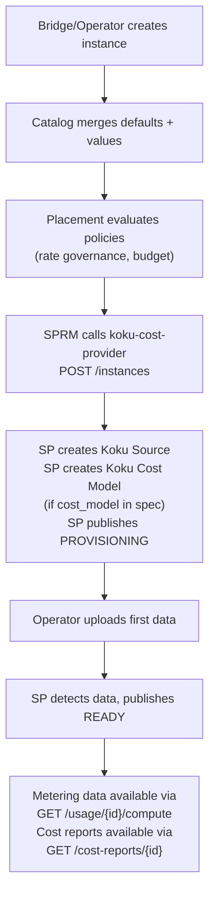
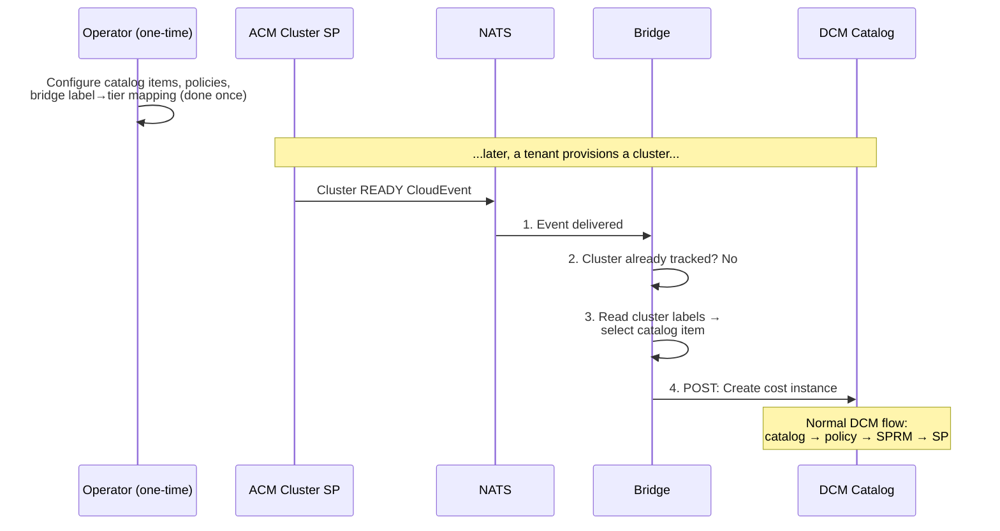
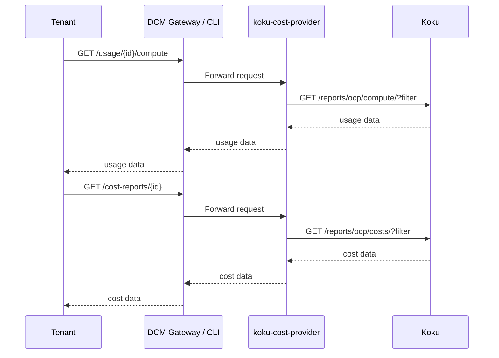
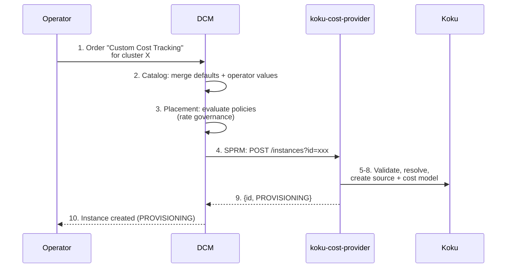
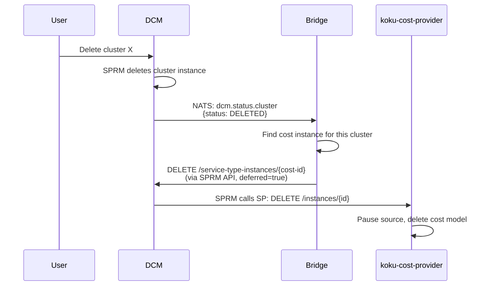
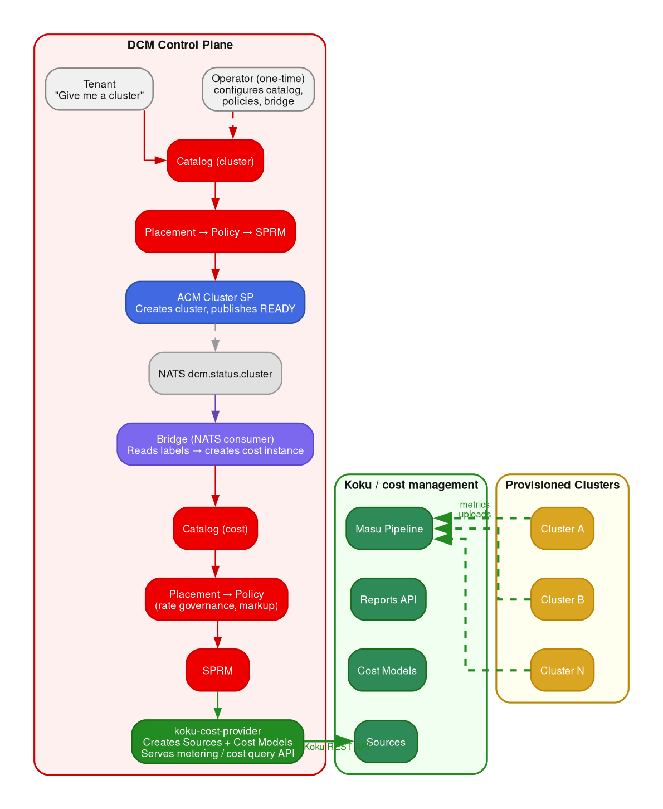
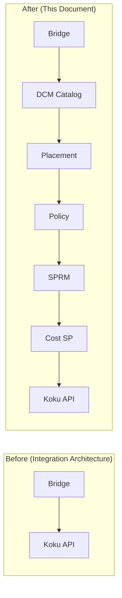

# Red Hat Lightspeed Cost Management — DCM Service Provider Design

**Version:** 1.3
**Date:** 2026-04-17
**Prerequisites:** [Integration Architecture](./Cost-Management-DCM-Integration-Architecture.md),
[DCM Architecture Guide](./DCM-Architecture-and-Integration-Guide.md)

---

## Table of Contents

1. [Executive Summary](#1-executive-summary)
2. [Why a New Service Type](#2-why-a-new-service-type)
3. [Service Type: `cost`](#3-service-type-cost)
4. [Service Provider: `koku-cost-provider`](#4-service-provider-koku-cost-provider)
5. [Catalog Items](#5-catalog-items)
6. [Catalog Item Instances](#6-catalog-item-instances)
7. [End-to-End Workflows](#7-end-to-end-workflows)
8. [Policies](#8-policies)
9. [Architecture Summary](#9-architecture-summary)
10. [Relationship to Integration Architecture](#10-relationship-to-integration-architecture)
11. [Open Questions](#11-open-questions)

---

## 1. Executive Summary

This document proposes a **DCM service provider** backed by Red Hat Lightspeed
Cost Management (Project Koku). It introduces a new `cost` service type, a set
of catalog items for metering and cost configurations, and a Go microservice
(`koku-cost-provider`) that translates DCM lifecycle events into Koku API
operations.

### Three Tiers of Visibility

Cost Management provides three tiers of data, each building on the previous:

**Tier 1 — Basic Metering (no cost model).**
The koku-metrics-operator collects raw utilization and capacity from
Prometheus: CPU, memory, and disk. Koku stores and reports these quantities.
No cost model needed — data flows as soon as the operator runs.

**Tier 2 — Metering + Distribution (cost model, no price list).**
An OCP cost model is created and assigned to the cluster's Koku Source, but
**without rates** (no price list). This enables Koku's overhead distribution
engine: overhead of running OpenShift — control plane, platform projects,
worker unallocated, storage unattributed, GPU unattributed, network
unattributed — is categorized and distributed across projects. Useful for
understanding where cluster overhead goes, even without dollar amounts.

**Tier 3 — Full Cost (cost model with price list).**
A price list (rates) is attached to the cost model. Now every metric in the
price list becomes a measurable quantity with a price: CPU core-hours, memory
GB-hours, node utilization, PVC count, VM core-hours, VM hours, and anything
else in the Koku price list. This is `cost = metering × rate`.

Each tier is an additive step. The SP supports all three through a single
instance — the difference is what's in the spec: no `cost_model`, a
`cost_model` without `rates`, or a `cost_model` with `rates`.

### Design Questions

| Question | Answer |
|----------|--------|
| **New service type?** | Yes — `cost`. Metering and cost tracking is not a VM, container, cluster, or database. It is a capability that applies to those. |
| **What does the SP provision?** | A Koku Source, the metrics operator on the target cluster, and optionally a cost model (with or without rates). |
| **What catalog items?** | Curated profiles at each tier — "Basic Metering", "Metering + Distribution", "Standard Cost Tracking", "Custom Cost", "Chargeback", "Development" — progressing from no cost model to full price list. |
| **What is an instance?** | One active metering/cost relationship: "cluster X is monitored at tier N". |
| **What policies?** | Rate/markup governance, budget enforcement, and automatic cost-model assignment based on labels. |

### Design Principles

1. **No special plumbing.** The cost SP uses DCM's existing SP contract — the
   same `POST` / `DELETE` / CloudEvent lifecycle as any other provider. No new
   DCM APIs or hooks required.
2. **Koku does all the work.** The SP is a thin lifecycle manager that
   configures Koku via its REST API. It does not duplicate Koku's metering
   pipeline, rate engine, distribution logic, or reporting.
3. **Full-cluster visibility.** Every `cost` instance covers the entire
   cluster — all namespaces, pods, PVCs, VMs. Per-resource drill-down is a
   query filter, not a separate instance.
4. **Three tiers, one instance.** Basic metering flows with no cost model.
   Adding a cost model enables overhead distribution. Adding a price list
   enables full financial metering. The operator chooses the tier per class
   of cluster; the SP handles the rest.
5. **Explicit over magic.** Metering/cost tracking is a first-class DCM
   resource with its own lifecycle, visible in the catalog, governed by
   policies, and deletable like anything else. Automation that creates
   instances goes through the same catalog pipeline.

### Personas

DCM serves the **service provider** persona — the organization operating the
data center (telco, government agency, large enterprise platform team,
managed service provider). Two roles matter for cost management:

**Platform operator (DCM admin).** Configures service providers, catalog
items, policies, and cost profiles. Decides which tier of cost tracking
applies to which class of clusters. Wants cost visibility on **every**
cluster — for chargeback, capacity planning, financial reporting, and
budget enforcement. Cost tracking is not optional from the operator's
perspective; it's infrastructure policy.

**Tenant (DCM user).** Orders infrastructure from the catalog ("give me a
cluster", "give me a VM"). **Consumes** cost and metering data — "how much
is my team spending?", "what's my CPU utilization?" — but does **not**
configure the cost model. The operator controls rates, markup, distribution,
and tier selection. The tenant sees the results.

This means:
- **Catalog items** are configured by the operator, not the tenant.
- **The primary workflow is automatic:** the operator sets up policies and
  bridge automation so that every provisioned cluster gets cost tracking at
  the appropriate tier, without tenant involvement.
- **The tenant's interaction** is read-only: querying metering data and cost
  reports for their clusters through the cost SP's query API.
- **Manual cost instance creation** is a secondary workflow for operator
  overrides (e.g., switching a cluster to a different tier, or applying
  cost tracking to a cluster that was missed by automation).

---

## 2. Why a New Service Type

DCM's existing service types:

| Type | What it provisions |
|------|--------------------|
| `vm` | A virtual machine |
| `container` | A container deployment |
| `cluster` | A Kubernetes cluster |
| `database` | A database instance |
| `three-tier-app-demo` | A multi-component demo app |

None of these describe metering or cost tracking. The alternatives to a new
type are:

**Alternative A — Metering/cost fields inside `cluster` catalog items.**
Reject: this couples cluster provisioning to metering/cost management.
Different admins manage each. And metering can be added/removed independently
of the cluster's lifecycle.

**Alternative B — No service type; bridge handles everything in the
background.** Reject: invisible infrastructure. No catalog entry, no policy
governance, no lifecycle management, no audit trail. The metering/cost
configuration becomes a side channel that DCM doesn't know about.

**Alternative C — New `cost` service type.** Accept. Cleanly separates
concerns. The catalog can offer different cost profiles. Policies can govern
rates and budgets. The instance lifecycle is explicit and manageable.

The `cost` type extends the catalog enum:

```yaml
enum:
  - vm
  - container
  - database
  - cluster
  - three-tier-app-demo
  - cost
```

---

## 3. Service Type: `cost`

### Spec Schema (`cost/spec.yaml`)

```yaml
CostSpec:
  allOf:
    - $ref: '../common.yaml#/components/schemas/CommonFields'
    - type: object
      required:
        - target
      properties:
        target:
          type: object
          required:
            - resource_id
          properties:
            resource_id:
              type: string
              description: >
                DCM instance ID of the cluster to track costs for.
            resource_type:
              type: string
              description: >
                Service type of the target resource. Currently only "cluster"
                is supported.
              default: cluster
        cost_model:
          $ref: '#/components/schemas/CostModelSpec'
        currency:
          type: string
          description: ISO 4217 currency code for cost reports.
          default: USD

CostModelSpec:
  type: object
  properties:
    rates:
      type: array
      description: >
        Per-metric rates. Each rate defines a price for one usage metric.
      items:
        $ref: '#/components/schemas/Rate'
    markup:
      type: object
      description: >
        Markup applied on top of infrastructure costs.
      properties:
        value:
          type: number
          description: Markup percentage (e.g. 10 means 10%).
          default: 0
        unit:
          type: string
          enum: [percent]
          default: percent
    distribution:
      type: string
      description: >
        How unattributed platform/worker overhead is distributed across
        namespaces. "cpu" weights by CPU usage, "memory" by memory usage.
      enum: [cpu, memory]
      default: cpu

Rate:
  type: object
  required:
    - metric
    - value
  properties:
    metric:
      type: string
      description: >
        The usage metric this rate applies to. Must be one of the Koku
        cost model metrics.
      enum:
        - cpu_core_usage_per_hour
        - cpu_core_request_per_hour
        - memory_gb_usage_per_hour
        - memory_gb_request_per_hour
        - storage_gb_usage_per_month
        - storage_gb_request_per_month
        - node_cost_per_month
        - cluster_cost_per_month
        - pvc_cost_per_month
    cost_type:
      type: string
      description: >
        Whether this rate is an infrastructure cost or supplementary.
      enum: [Infrastructure, Supplementary]
      default: Infrastructure
    value:
      type: number
      description: >
        Price per unit per period (e.g. USD per core-hour, USD per
        GB-month).
      minimum: 0
```

### Key Design Decisions in the Schema

**Why `target.resource_id` instead of `target.cluster_id`?**
Because the cost SP resolves the DCM instance ID to the actual OpenShift
`cluster_id` at creation time. The user works with DCM identifiers — they
don't need to know Koku's internal cluster UUID. This also allows future
extension to non-cluster resources without schema changes.

**Why is `cost_model` optional? Why are `rates` optional within it?**
This enables the three-tier model:
- **No `cost_model`** (Tier 1 — Basic Metering): SP creates a Koku Source and
  deploys the operator. CPU, memory, and disk utilization/capacity flow. No
  cost model, no overhead distribution, no dollar amounts.
- **`cost_model` without `rates`** (Tier 2 — Distribution): SP creates a Koku
  Source AND a cost model (source_type=OCP) with distribution settings but no
  price list. This enables overhead categorization and distribution (platform,
  worker, storage, network, GPU) without assigning dollar amounts.
- **`cost_model` with `rates`** (Tier 3 — Full Cost): SP creates source, cost
  model, and attaches the price list. Every metric in the price list becomes a
  measurable quantity with a price.

Catalog items can also fix the cost model entirely — the "Standard Cost
Tracking" item provides fixed rates as defaults, invisible to the tenant.

**Why are rates an explicit enum?**
Koku has a fixed set of cost model metrics. Accepting arbitrary metric names
would create configurations that Koku can't apply. The enum ensures validity
at schema level rather than at runtime.

---

## 4. Service Provider: `koku-cost-provider`

### Registration

The provider registers with DCM's SPM on startup:

```json
{
  "name": "koku-cost-provider",
  "display_name": "Red Hat Lightspeed Cost Management",
  "service_type": "cost",
  "endpoint": "http://koku-cost-provider:8080/api/v1alpha1/instances",
  "schema_version": "v1alpha1",
  "operations": ["create", "delete"],
  "metadata": {
    "koku_api_url": "http://koku:8000/api/cost-management/v1",
    "supported_source_types": ["OCP"]
  }
}
```

### Endpoint Contract

The SP implements the standard SPRM contract:

**Create:** `POST http://koku-cost-provider:8080/api/v1alpha1/instances?id={instance_id}`

Request body (from SPRM):
```json
{
  "spec": {
    "service_type": "cost",
    "metadata": {
      "name": "prod-cluster-cost-tracking",
      "labels": {
        "environment": "production",
        "team": "platform"
      }
    },
    "target": {
      "resource_id": "dcm-cluster-abc-123",
      "resource_type": "cluster"
    },
    "cost_model": {
      "rates": [
        {"metric": "cpu_core_usage_per_hour", "cost_type": "Infrastructure", "value": 0.05},
        {"metric": "memory_gb_usage_per_hour", "cost_type": "Infrastructure", "value": 0.01},
        {"metric": "node_cost_per_month", "cost_type": "Infrastructure", "value": 200}
      ],
      "markup": {"value": 15, "unit": "percent"},
      "distribution": "cpu"
    },
    "currency": "USD"
  }
}
```

Response:
```json
{
  "id": "{instance_id}",
  "status": "PROVISIONING"
}
```

**Delete:** `DELETE http://koku-cost-provider:8080/api/v1alpha1/instances/{instance_id}`

Response: `204 No Content`

### Internal Workflow — Create

When the SP receives a create request, it executes this sequence:

```
┌──────────────────────────────────────────────────────────────────┐
│  koku-cost-provider receives POST /instances?id=xxx              │
│                                                                  │
│  1. Validate target cluster exists                               │
│     GET DCM SPRM /service-type-instances/{target.resource_id}    │
│     → Confirm status == READY                                    │
│     → Extract provider_name, spec details                        │
│                                                                  │
│  2. Resolve OpenShift cluster_id                                 │
│     Read kubeconfig from ACM hub:                                │
│       Secret {hostedcluster}-admin-kubeconfig                    │
│     Query target cluster:                                        │
│       GET /apis/config.openshift.io/v1/clusterversions/version   │
│     → Extract .spec.clusterID                                    │
│                                                                  │
│  3. Create Koku Source                                           │
│     POST /api/cost-management/v1/sources/                        │
│     Body: {                                                      │
│       "name": "{spec.metadata.name}",                            │
│       "source_type": "OCP",                                      │
│       "authentication": {                                        │
│         "credentials": {"cluster_id": "{resolved_cluster_id}"}   │
│       }                                                          │
│     }                                                            │
│     → Store koku_source_uuid                                     │
│                                                                  │
│  4. Create Koku Cost Model (if spec.cost_model is present)        │
│     Skip entirely for Tier 1 (basic metering — no cost_model).   │
│                                                                  │
│     POST /api/cost-management/v1/cost-models/                    │
│     Body: {                                                      │
│       "name": "dcm-{instance_id}",                               │
│       "source_type": "OCP",                                      │
│       "source_uuids": ["{koku_source_uuid}"],                    │
│       "rates": [ ... mapped from spec.cost_model.rates ... ],    │
│         ↑ omitted for Tier 2 (distribution only, no price list)  │
│         ↑ included for Tier 3 (full cost)                        │
│       "markup": {"value": spec.cost_model.markup.value,          │
│                  "unit": "percent"},                              │
│       "distribution": "{spec.cost_model.distribution}",          │
│       "currency": "{spec.currency}"                              │
│     }                                                            │
│     → Store koku_cost_model_uuid (null for Tier 1)               │
│                                                                  │
│  5. Ensure metrics operator deployment                           │
│     The operator is deployed via ACM Policy matching the label   │
│     dcm.project/managed-by=dcm (already set by ACM Cluster SP). │
│     The SP verifies the policy exists; it does not deploy the    │
│     operator directly.                                           │
│                                                                  │
│  6. Store mapping                                                │
│     dcm_instance_id → {                                          │
│       target_resource_id,                                        │
│       cluster_id,                                                │
│       koku_source_uuid,                                          │
│       koku_cost_model_uuid                                       │
│     }                                                            │
│                                                                  │
│  7. Return {id, status: "PROVISIONING"}                          │
│                                                                  │
│  8. Background: poll for first metering data                     │
│     Periodically check:                                          │
│       GET /api/cost-management/v1/sources/{uuid}/stats/          │
│     When data appears → publish NATS CloudEvent:                 │
│       type: dcm.status.cost                                      │
│       data: {id: instance_id, status: "READY"}                   │
└──────────────────────────────────────────────────────────────────┘
```

### Internal Workflow — Delete

```
┌──────────────────────────────────────────────────────────────────┐
│  koku-cost-provider receives DELETE /instances/{id}               │
│                                                                  │
│  1. Look up mapping for instance_id                              │
│                                                                  │
│  2. Remove cost model (if one was assigned)                      │
│     DELETE /api/cost-management/v1/cost-models/{uuid}            │
│                                                                  │
│  3. Pause or remove Koku Source                                  │
│     PATCH /api/cost-management/v1/sources/{uuid}/                │
│     Body: {"paused": true}                                       │
│     (Pausing preserves historical cost data. Delete removes it.) │
│                                                                  │
│  4. Clean up mapping                                             │
│                                                                  │
│  5. Publish NATS CloudEvent:                                     │
│     type: dcm.status.cost                                        │
│     data: {id: instance_id, status: "DELETED"}                   │
│                                                                  │
│  6. Return 204                                                   │
│                                                                  │
│  Note: The metrics operator on the cluster is NOT removed.       │
│  The cluster may have other cost instances, or the operator      │
│  is managed by ACM Policy (cluster-scoped, not instance-scoped). │
│  The operator is removed when the cluster itself is deleted.     │
└──────────────────────────────────────────────────────────────────┘
```

### Status Events

The SP publishes CloudEvents to NATS:

```json
{
  "specversion": "1.0",
  "id": "event-uuid",
  "source": "dcm/providers/koku-cost-provider",
  "type": "dcm.status.cost",
  "subject": "cost-instance-id",
  "time": "2026-04-17T10:30:00Z",
  "datacontenttype": "application/json",
  "data": {
    "id": "cost-instance-id",
    "status": "READY",
    "message": "Cost data is flowing. First data received 2026-04-17T10:25:00Z."
  }
}
```

Status lifecycle:
- **PROVISIONING** → Koku Source created; waiting for first metering data
- **READY** → Metering data is actively being collected and processed
  (cost data is also available if a cost model was assigned)
- **ERROR** → Something broke (operator not uploading, Koku API unreachable)
- **DELETED** → Metering/cost tracking removed (source paused/deleted)

### Authentication

The SP authenticates to Koku using a **service account** with a pre-configured
identity. On-prem Koku uses `x-rh-identity` headers with a base64-encoded
JSON identity. The SP's service account identity is configured at deployment
time and grants access to create/manage sources and cost models.

### Metering and Cost Query API (Read-Only Extension)

In addition to the standard SPRM lifecycle, the SP exposes a **read-only API
for metering and cost queries on its own HTTP server**. These are new
endpoints served by `koku-cost-provider`, not by DCM core. DCM's gateway or
CLI calls them; they are not part of the SPRM contract.

**Metering endpoints** (always available — no cost model required):

```
GET  /api/v1alpha1/usage/{dcm-instance-id}/compute
     → CPU usage, requests, and capacity (core-hours)

GET  /api/v1alpha1/usage/{dcm-instance-id}/memory
     → Memory usage, requests, and capacity (GB-hours)

GET  /api/v1alpha1/usage/{dcm-instance-id}/storage
     → PVC usage, requests, and capacity (GB-months)

GET  /api/v1alpha1/usage/{dcm-instance-id}/namespaces
     → Per-namespace usage breakdown (all metrics)
```

**Cost endpoints** (available when a cost model is assigned):

```
GET  /api/v1alpha1/cost-reports/{dcm-instance-id}
     → Cost summary for a specific cluster (current month)

GET  /api/v1alpha1/cost-reports/{dcm-instance-id}?start_date=...&end_date=...
     → Cost summary for a specific date range

GET  /api/v1alpha1/cost-reports/{dcm-instance-id}/breakdown
     → Detailed cost breakdown: CPU, memory, storage, distributed, markup

GET  /api/v1alpha1/cost-reports/{dcm-instance-id}/forecast
     → Cost forecast for the current/next month

GET  /api/v1alpha1/cost-reports/{dcm-instance-id}/namespaces
     → Per-namespace cost breakdown within the cluster
```

**Common endpoints:**

```
GET  /api/v1alpha1/cost-reports
     → List all tracked clusters with current metering summaries and costs
       (costs are null for Tier 1/2 instances without rates)
```

Each endpoint translates to one or more Koku Report API calls:

| SP Endpoint | Koku API Call |
|-------------|---------------|
| `/usage/{id}/compute` | `GET /reports/openshift/compute/?filter[cluster]={cluster_id}` |
| `/usage/{id}/memory` | `GET /reports/openshift/memory/?filter[cluster]={cluster_id}` |
| `/usage/{id}/storage` | `GET /reports/openshift/volumes/?filter[cluster]={cluster_id}` |
| `/cost-reports/{id}` | `GET /reports/openshift/costs/?filter[cluster]={cluster_id}` |
| `/cost-reports/{id}/breakdown` | `GET /reports/openshift/costs/?filter[cluster]={cluster_id}&group_by[project]=*` |
| `/cost-reports/{id}/forecast` | `GET /forecasts/openshift/costs/?filter[cluster]={cluster_id}` |
| `/cost-reports/{id}/namespaces` | `GET /reports/openshift/costs/?filter[cluster]={cluster_id}&group_by[project]=*` |

Note: Koku's cost report endpoints also return usage quantities alongside
dollar amounts. The `/usage/` endpoints surface the same metering data through
Koku's compute/memory/volume report endpoints, which return usage quantities
without cost calculations. This means metering data is accessible even when
no cost model is configured.

---

## 5. Catalog Items

Catalog items are configured by the **platform operator** (DCM admin). They
define what cost profiles are available and which fields (if any) are
tenant-configurable. In most deployments, the operator fixes all fields and
the bridge automation selects the appropriate catalog item based on cluster
labels — tenants never interact with these directly.

### 5.1 Basic Cluster Metering (Tier 1)

Raw utilization visibility for capacity planning, quota auditing, and
resource accounting. No cost model, no overhead distribution, no financial
data.

```yaml
apiVersion: v1alpha1
kind: CatalogItem
metadata:
  name: cluster-metering-basic
  displayName: "Basic Cluster Metering"
spec:
  serviceType: cost
  fields:
    - path: "target.resource_id"
      displayName: "Target Cluster"
      editable: true
      validationSchema:
        type: string
        minLength: 1
```

**Typical use:** The bridge auto-creates this for clusters labeled
`cost-tier: basic`. The SP creates a Koku Source and deploys the metrics
operator. CPU, memory, and disk utilization/capacity data flows. No cost
model, no distribution, no dollar amounts. Usage endpoints return data;
cost endpoints return nulls.

This is the simplest catalog item — no decisions about rates, markup, or
distribution. Suitable for dev/test clusters where the operator only needs
utilization visibility.

### 5.2 Cluster Metering + Distribution (Tier 2)

Basic metering plus overhead categorization. A cost model is created
(source_type=OCP) with distribution settings but **no price list**. This
enables visibility into how OpenShift overhead is distributed: control
plane, platform projects, worker unallocated, storage unattributed, GPU
unattributed, network unattributed.

```yaml
apiVersion: v1alpha1
kind: CatalogItem
metadata:
  name: cluster-metering-distribution
  displayName: "Cluster Metering + Distribution"
spec:
  serviceType: cost
  fields:
    - path: "target.resource_id"
      displayName: "Target Cluster"
      editable: true
      validationSchema:
        type: string
        minLength: 1

    # Cost model exists but with no rates (no price list)
    # The presence of the cost_model object (even without rates)
    # tells the SP to create a Koku cost model for distribution.

    # User can choose distribution strategy
    - path: "cost_model.distribution"
      displayName: "Overhead Distribution Method"
      editable: true
      default: cpu
      validationSchema:
        type: string
        enum: [cpu, memory]
```

**Typical use:** The bridge auto-creates this for clusters labeled
`cost-tier: distribution`. The operator can choose CPU-weighted or
memory-weighted distribution at the catalog item level (fixing it for all
clusters in this class) or leave it editable for per-cluster override. No
rates, no markup, no dollar amounts — but overhead is categorized and
distributed across projects, enabling capacity planning and overhead
attribution.

### 5.3 Standard Cluster Cost Tracking (Tier 3)

For production clusters with organization-standard rates.

```yaml
apiVersion: v1alpha1
kind: CatalogItem
metadata:
  name: standard-cluster-cost-tracking
  displayName: "Standard Cluster Cost Tracking"
spec:
  serviceType: cost
  fields:
    # User must pick the target cluster
    - path: "target.resource_id"
      displayName: "Target Cluster"
      editable: true
      validationSchema:
        type: string
        minLength: 1

    # Fixed: standard rates (not user-editable)
    - path: "cost_model.rates"
      editable: false
      default:
        - metric: cpu_core_usage_per_hour
          cost_type: Infrastructure
          value: 0.048
        - metric: memory_gb_usage_per_hour
          cost_type: Infrastructure
          value: 0.009
        - metric: storage_gb_usage_per_month
          cost_type: Infrastructure
          value: 0.04
        - metric: node_cost_per_month
          cost_type: Infrastructure
          value: 250

    # Fixed: no markup
    - path: "cost_model.markup.value"
      editable: false
      default: 0

    # Fixed: CPU-weighted distribution
    - path: "cost_model.distribution"
      editable: false
      default: cpu

    # Fixed: USD
    - path: "currency"
      editable: false
      default: USD
```

**Typical use:** The bridge auto-creates this for production clusters. All
fields are fixed by the operator — rates, markup, distribution, currency.
The default catalog item for clusters with no specific label override.

### 5.4 Custom Cluster Cost Tracking (Tier 3)

For operator overrides where a specific cluster needs non-standard rates
(within policy constraints). This is the only catalog item where rate fields
are editable — used for manual setup, not automatic bridge creation.

```yaml
apiVersion: v1alpha1
kind: CatalogItem
metadata:
  name: custom-cluster-cost-tracking
  displayName: "Custom Cluster Cost Tracking"
spec:
  serviceType: cost
  fields:
    - path: "target.resource_id"
      displayName: "Target Cluster"
      editable: true
      validationSchema:
        type: string
        minLength: 1

    # User can set CPU rate (within schema bounds)
    - path: "cost_model.rates"
      displayName: "Cost Rates"
      editable: true
      default:
        - metric: cpu_core_usage_per_hour
          cost_type: Infrastructure
          value: 0.048
        - metric: memory_gb_usage_per_hour
          cost_type: Infrastructure
          value: 0.009
        - metric: storage_gb_usage_per_month
          cost_type: Infrastructure
          value: 0.04

    # User can set markup (0-50% range enforced by policy)
    - path: "cost_model.markup.value"
      displayName: "Markup (%)"
      editable: true
      default: 0
      validationSchema:
        type: number
        minimum: 0
        maximum: 50

    # User can choose distribution strategy
    - path: "cost_model.distribution"
      displayName: "Cost Distribution"
      editable: true
      default: cpu
      validationSchema:
        type: string
        enum: [cpu, memory]

    - path: "currency"
      displayName: "Currency"
      editable: true
      default: USD
      validationSchema:
        type: string
        enum: [USD, EUR, GBP, JPY, CAD]
```

**Typical use:** The operator manually creates this for specific clusters
that need non-standard pricing. Rates, markup, distribution, and currency
are all editable (within policy constraints). Not used by the bridge —
this is an operator override tool.

### 5.5 Internal Chargeback (Tier 3)

For operators that charge tenants for infrastructure usage. Rates are fixed
by the operator; only markup is configurable (within a constrained range).

```yaml
apiVersion: v1alpha1
kind: CatalogItem
metadata:
  name: chargeback-cost-tracking
  displayName: "Internal Chargeback"
spec:
  serviceType: cost
  fields:
    - path: "target.resource_id"
      displayName: "Target Cluster"
      editable: true
      validationSchema:
        type: string
        minLength: 1

    # Fixed: organization-standard infrastructure rates
    - path: "cost_model.rates"
      editable: false
      default:
        - metric: cpu_core_usage_per_hour
          cost_type: Infrastructure
          value: 0.048
        - metric: memory_gb_usage_per_hour
          cost_type: Infrastructure
          value: 0.009
        - metric: storage_gb_usage_per_month
          cost_type: Infrastructure
          value: 0.04
        - metric: node_cost_per_month
          cost_type: Infrastructure
          value: 250
        - metric: cluster_cost_per_month
          cost_type: Supplementary
          value: 500

    # Operator sets the chargeback markup (10-30%)
    - path: "cost_model.markup.value"
      displayName: "Chargeback Markup (%)"
      editable: true
      default: 15
      validationSchema:
        type: number
        minimum: 10
        maximum: 30

    # Fixed: memory-weighted (fairer for chargeback)
    - path: "cost_model.distribution"
      editable: false
      default: memory

    - path: "currency"
      editable: false
      default: USD
```

**Typical use:** The bridge auto-creates this for clusters labeled
`chargeback: enabled`. The operator sets markup range (10-30%) at the catalog
level. Rates and distribution are fixed — tenants see the resulting costs
but don't control the pricing model.

### 5.6 Development Cluster Cost Tracking (Tier 3)

Simplified cost tracking for dev/test clusters.

```yaml
apiVersion: v1alpha1
kind: CatalogItem
metadata:
  name: dev-cluster-cost-tracking
  displayName: "Development Cost Tracking"
spec:
  serviceType: cost
  fields:
    - path: "target.resource_id"
      displayName: "Target Cluster"
      editable: true
      validationSchema:
        type: string
        minLength: 1

    # Fixed: lower dev rates
    - path: "cost_model.rates"
      editable: false
      default:
        - metric: cpu_core_usage_per_hour
          cost_type: Infrastructure
          value: 0.02
        - metric: memory_gb_usage_per_hour
          cost_type: Infrastructure
          value: 0.005

    # Fixed: no markup for dev
    - path: "cost_model.markup.value"
      editable: false
      default: 0

    - path: "cost_model.distribution"
      editable: false
      default: cpu

    - path: "currency"
      editable: false
      default: USD
```

**Typical use:** The bridge auto-creates this for clusters labeled
`environment: development`. Lower rates reflect the reduced SLA and
resource guarantees of development infrastructure.

---

## 6. Catalog Item Instances

A catalog item instance represents one **active metering/cost relationship**
between a DCM cluster and Koku, at one of the three tiers.

### Instance Examples

**Tier 1 — Basic metering** (bridge or operator selects "Basic Cluster Metering"):

```yaml
apiVersion: v1alpha1
kind: CatalogItemInstance
metadata:
  name: staging-cluster-metering
spec:
  catalogItemId: cluster-metering-basic
  userValues:
    - path: "target.resource_id"
      value: "dcm-cluster-staging-01"
```

**Tier 2 — Distribution** (bridge or operator selects "Cluster Metering + Distribution"):

```yaml
apiVersion: v1alpha1
kind: CatalogItemInstance
metadata:
  name: shared-cluster-distribution
spec:
  catalogItemId: cluster-metering-distribution
  userValues:
    - path: "target.resource_id"
      value: "dcm-cluster-shared-01"
    - path: "cost_model.distribution"
      value: "memory"
```

**Tier 3 — Full cost** (bridge or operator selects "Standard Cluster Cost Tracking"):

```yaml
apiVersion: v1alpha1
kind: CatalogItemInstance
metadata:
  name: prod-cluster-01-cost
spec:
  catalogItemId: standard-cluster-cost-tracking
  userValues:
    - path: "target.resource_id"
      value: "dcm-cluster-abc-123"
```

In all cases the catalog manager merges the values with the catalog item
defaults and sends the resulting spec to the placement manager → policy
engine → SPRM → cost SP.

### What the Instance Represents

| Aspect | Value |
|--------|-------|
| **Existence** | "Cluster X is metered at tier N" |
| **Tier** | Determined by what's in the spec: no cost_model (Tier 1), cost_model without rates (Tier 2), cost_model with rates (Tier 3) |
| **Status** | PROVISIONING → READY → ERROR (tracks whether metering data is flowing) |
| **Deletion** | Stops metering/cost tracking; pauses the Koku source; preserves historical data |
| **1:1 with cluster** | One instance per cluster. Multiple instances for the same cluster are rejected (SP validates uniqueness). |
| **Lifecycle dependency** | The target cluster must exist and be READY. Deleting the cluster should trigger deletion of its cost instance (via NATS event). |
| **Upgrade path** | An instance can be upgraded across tiers: Tier 1 → Tier 2 (add cost model for distribution), Tier 2 → Tier 3 (add price list). All changes go through Koku's API. |

### Instance Lifecycle



---

## 7. End-to-End Workflows

### 7.1 Automatic Setup (Primary — Operator-Driven)

The **primary workflow.** The operator configures cost profiles (catalog items)
and bridge automation once. After that, every cluster provisioned through DCM
automatically gets metering/cost tracking at the appropriate tier — no human
intervention per cluster.



The bridge selects the catalog item based on the cluster's labels:

| Label | Catalog Item | Tier |
|-------|-------------|------|
| `cost-tier: basic` | `cluster-metering-basic` | 1 |
| `cost-tier: distribution` | `cluster-metering-distribution` | 2 |
| `environment: production` | `standard-cluster-cost-tracking` | 3 |
| `environment: development` | `dev-cluster-cost-tracking` | 3 |
| `chargeback: enabled` | `chargeback-cost-tracking` | 3 |
| (no matching label) | `standard-cluster-cost-tracking` (default) | 3 |

This automation goes through the full DCM pipeline — catalog validation,
policy evaluation, SPRM — so cost governance policies apply.

The key point: **tenants provision clusters; the operator's automation
provisions cost tracking.** The tenant doesn't know or care about the cost
instance — it's infrastructure policy, like monitoring or logging.

### 7.2 Tenant Queries Cost Data (Read-Only)

After cost tracking is set up (automatically by the bridge), tenants query
their metering and cost data through the cost SP's read-only API.



The tenant sees costs for **their** clusters only — filtered by the DCM
instance IDs they own. They cannot see other tenants' data, change rates,
or modify the cost model. RBAC on the cost SP's query API enforces this.

### 7.3 Manual Override (Operator-Initiated)

A **secondary workflow** for operator overrides: switching a cluster to a
different tier, applying custom rates to a specific cluster, or handling
edge cases the automation doesn't cover.



If the cluster already has a cost instance (from automation), the operator
deletes the existing instance first and creates a new one with the custom
catalog item. In v2, in-place updates could be supported.

### 7.3 Cluster Deletion Cascade

When a cluster is deleted, its cost instance should be cleaned up.



The bridge triggers the delete through DCM's standard SPRM API (using
`deferred=true` for robustness). This means the deletion goes through DCM's
normal lifecycle, maintaining audit trail and consistency.

---

## 8. Policies

### 8.1 Rate Governance (Global Policy)

Ensures that no cost instance uses rates below a minimum or above a maximum.
This prevents users from setting unrealistically low rates that would
underreport costs.

```rego
package policies.cost_rate_governance

import rego.v1

main := decision if {
    input.spec.service_type == "cost"
    decision := rate_constraints
}

default rate_constraints := {"rejected": false}

rate_constraints := {
    "rejected": false,
    "constraints": {
        "cost_model.rates": {
            "items": {
                "properties": {
                    "value": {
                        "minimum": 0.001,
                        "maximum": 100
                    }
                }
            }
        },
        "cost_model.markup.value": {
            "minimum": 0,
            "maximum": 50
        }
    }
} if {
    input.spec.cost_model
}
```

This policy uses DCM's constraint mechanism (JSON Schema 2020-12 fragments)
to tighten the allowed values without rejecting the request outright.

### 8.2 Production Markup Enforcement (Global Policy)

Ensures production clusters always have at least 10% markup for chargeback.

```rego
package policies.production_markup

import rego.v1

main := decision if {
    input.spec.service_type == "cost"
    decision := enforce_markup
}

default enforce_markup := {"rejected": false}

enforce_markup := {
    "rejected": false,
    "patch": {
        "cost_model": {
            "markup": {
                "value": 10,
                "unit": "percent"
            }
        }
    }
} if {
    target_labels := get_target_labels(input.spec.target.resource_id)
    target_labels.environment == "production"
    input.spec.cost_model.markup.value < 10
}

get_target_labels(resource_id) := labels if {
    resp := http.send({
        "method": "GET",
        "url": sprintf("http://sprm:8080/api/v1alpha1/service-type-instances/%s", [resource_id]),
        "raise_error": false
    })
    resp.status_code == 200
    labels := resp.body.spec.metadata.labels
}
```

This policy patches the markup to 10% if a production cluster's cost instance
specifies less. It uses `http.send` to look up the target cluster's labels
from DCM's SPRM.

### 8.3 Budget Enforcement (Global Policy — on `cluster` type)

This policy runs on the **cluster** service type (not `cost`). It estimates
the monthly cost of a new cluster before provisioning and rejects if the
total projected spend exceeds a budget.

```rego
package policies.cluster_budget

import rego.v1

main := decision if {
    input.spec.service_type == "cluster"
    decision := budget_check
}

default budget_check := {"rejected": false}

budget_check := {
    "rejected": true,
    "rejection_reason": sprintf(
        "Projected monthly cost $%.2f exceeds budget $%.2f. Reduce worker count or CPU.",
        [projected, budget]
    )
} if {
    budget := 50000
    current_spend := get_current_spend()
    new_cluster_estimate := estimate_cost(input.spec)
    projected := current_spend + new_cluster_estimate
    projected > budget
}

estimate_cost(spec) := cost if {
    workers := object.get(spec, ["nodes", "workers", "count"], 3)
    cpu := object.get(spec, ["nodes", "workers", "cpu"], 4)
    memory_gb := object.get(spec, ["nodes", "workers", "memory"], 16)
    cpu_rate := 0.048
    memory_rate := 0.009
    hours_per_month := 730
    cost := (workers * cpu * cpu_rate * hours_per_month) +
            (workers * memory_gb * memory_rate * hours_per_month)
}

get_current_spend() := total if {
    resp := http.send({
        "method": "GET",
        "url": "http://koku-cost-provider:8080/api/v1alpha1/cost-reports",
        "raise_error": false
    })
    resp.status_code == 200
    total := resp.body.total_cost
}
```

This is a cross-cutting policy: it operates on cluster provisioning requests
but uses cost data from the cost SP to enforce financial governance.

### 8.4 Provider Selection (Global Policy — on `cost` type)

Selects the cost provider. With only one cost SP this is straightforward,
but the pattern supports future multi-provider scenarios (e.g., different
cost engines for different environments).

```rego
package policies.cost_provider_selection

import rego.v1

main := {
    "rejected": false,
    "selected_provider": "koku-cost-provider"
} if {
    input.spec.service_type == "cost"
}
```

This is required because DCM's placement manager expects every policy chain
to produce a `selected_provider`. Without this policy, cost instances would
fail with "policy response missing selected provider".

### Policy Summary

| Policy | Type | Applies To | Effect |
|--------|------|-----------|--------|
| Rate Governance | Global | `cost` | Constrains rate values to [0.001, 100] and markup to [0, 50%] |
| Production Markup | Global | `cost` | Patches markup to ≥10% for production clusters |
| Budget Enforcement | Global | `cluster` | Rejects cluster provisioning if projected spend exceeds budget |
| Provider Selection | Global | `cost` | Routes all cost instances to `koku-cost-provider` |

---

## 9. Architecture Summary



### Component Responsibilities

| Component | Owned By | Responsibilities |
|-----------|----------|-----------------|
| **koku-cost-provider** (SP) | Platform team | Receives create/delete from SPRM. Calls Koku API to manage Sources and (optionally) Cost Models. Publishes CloudEvents. Serves metering and cost query API to tenants (read-only). |
| **Bridge** (NATS consumer) | Platform team | Watches cluster events. Auto-creates cost instances via DCM's catalog API based on operator-configured label→catalog mappings. Handles cluster deletion cascade. |
| **Catalog items** | Operator | Operator-configured cost profiles across three tiers. Tenants don't interact with these directly — the bridge selects the right one. |
| **Policies** | Operator | Govern rate ranges, enforce markup minimums, enforce budgets, select provider. Applied to both bridge-initiated and manual instances. |
| **Koku** | Platform team | All metering storage, cost calculation, rate application, distribution, forecasting, and reporting. Unchanged. |
| **Tenant** | (consumer) | Queries metering/cost data for their clusters via the cost SP's read-only API. No write access to cost configuration. |

The SP and the bridge can be the same Go binary with two roles:
1. **HTTP server** — handles SPRM create/delete requests and read-only query API
2. **NATS consumer** — watches cluster events and auto-creates cost instances

---

## 10. Relationship to Integration Architecture

This document refines and replaces sections 11 (Cost Service Provider for DCM)
and parts of section 10 (Communication Bridge) from the
[Integration Architecture](./Cost-Management-DCM-Integration-Architecture.md).

| Integration Architecture | This Document |
|--------------------------|---------------|
| Section 10: NATS bridge creates Koku Sources directly | Bridge creates cost instances via DCM catalog; cost SP creates Koku Sources |
| Section 11: Read-only cost SP sketch | Full lifecycle SP with create/delete, catalog items, and policies |
| Section 12: Policy examples | Expanded with rate governance, markup enforcement, budget check, provider selection |
| Section 15: Phased plan | Unaffected — phases still apply, with "cost SP" now being a full catalog-integrated provider |

The key architectural shift: instead of the bridge calling Koku directly, it
goes through DCM's standard provisioning pipeline. This means cost instances
get the same governance (catalog validation, policy evaluation, audit trail)
as any other DCM resource.



---

## 11. Open Questions

| Question | Options | Recommendation |
|----------|---------|----------------|
| **One cost instance per cluster, or allow multiple?** | (a) Strict 1:1, (b) Allow multiple cost models per cluster | **(a)** for v1 — simpler, avoids double-counting. SP rejects if a cost instance already exists for the target cluster. |
| **Should deleting a cluster auto-delete the cost instance?** | (a) Bridge triggers delete via SPRM, (b) SP watches NATS directly, (c) Manual cleanup | **(a)** — keeps everything in DCM's lifecycle model. |
| **What happens to historical cost data on delete?** | (a) Pause Koku source (preserves data), (b) Delete source (removes data), (c) Configurable | **(a)** — always preserve. Historical cost data is valuable for auditing and forecasting. |
| **How does the bridge select the catalog item for auto-creation?** | (a) Cluster labels, (b) Configuration file, (c) Default for all | **(a)** with **(b)** fallback — labels give flexibility, config provides a default. |
| **Should cost_model updates be supported (PUT/PATCH)?** | (a) Delete + recreate, (b) SP supports update, (c) Koku cost model is mutable via bridge | **(b)** long-term, **(a)** for v1 — Koku cost models are mutable (PUT), so the SP can support updates, but delete+recreate is simpler initially. |
| **Tag-based rates in the spec?** | (a) Include in v1, (b) Defer to v2 | **(b)** — tiered rates cover 90% of use cases. Tag rates add significant schema complexity. |
| **Can an instance be upgraded across tiers?** | (a) Update in place via Koku API, (b) Delete and recreate with a higher-tier catalog item, (c) Not supported | **(a)** long-term, **(b)** for v1. Tier 1→2 adds a cost model; Tier 2→3 adds rates. The Koku Source is unchanged in all cases. |
| **Should policies apply to Tier 1 (basic metering) instances?** | (a) Rate governance skipped (no rates), (b) Still evaluated (no-op) | **(b)** — policies always run. Rate/distribution constraints simply don't match when there's no `cost_model` in the spec. Provider selection still applies. |
