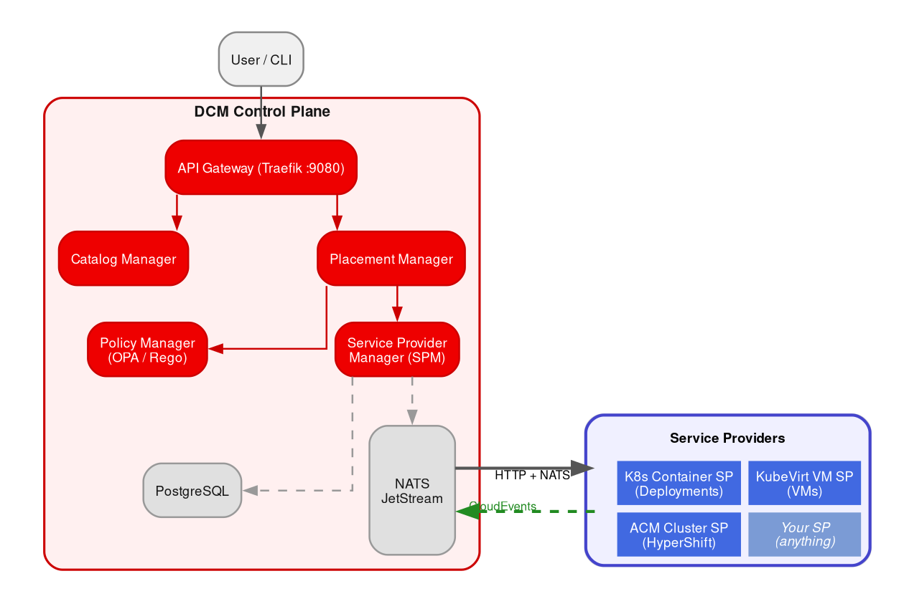
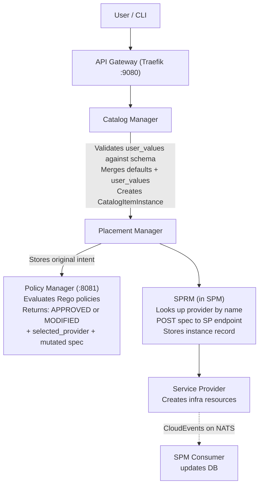

# DCM Architecture and Integration Guide

## For Service Provider Developers and Integration Architects

**Version:** 1.0
**Date:** 2026-04-17
**Source:** Analysis of [DCM Project](https://dcm-project.github.io/) codebase and enhancement proposals

---

## Table of Contents

1. [What is DCM](#1-what-is-dcm)
2. [Architecture Overview](#2-architecture-overview)
3. [Component Catalog](#3-component-catalog)
4. [The Service Catalog: Three-Layer Model](#4-the-service-catalog-three-layer-model)
5. [Service Providers: Concepts and Types](#5-service-providers-concepts-and-types)
6. [Communication Patterns and Data Exchange](#6-communication-patterns-and-data-exchange)
7. [Request Lifecycle: End-to-End Flow](#7-request-lifecycle-end-to-end-flow)
8. [Policy Engine and Governance](#8-policy-engine-and-governance)
9. [Status Reporting and Monitoring](#9-status-reporting-and-monitoring)
10. [Rehydration Flow](#10-rehydration-flow)
11. [Inter-Service-Provider Communication](#11-inter-service-provider-communication)
12. [Building a New Service Provider](#12-building-a-new-service-provider)
13. [Reference: ACM Cluster Service Provider](#13-reference-acm-cluster-service-provider)
14. [Glossary](#14-glossary)

---

## 1. What is DCM

DCM (Data Center Management) is an **API-first, technology-agnostic control
plane** that provides a hyperscaler-like cloud experience for enterprise
on-premises and sovereign cloud infrastructure. It follows a microservices
architecture with all components written in Go, communicating via REST/OpenAPI
and NATS JetStream.

**DCM is not a provisioning engine.** It is a routing, governance, and lifecycle
management framework. The actual provisioning of infrastructure (VMs, containers,
clusters, databases) is delegated to **Service Providers** — pluggable
microservices that implement a standard HTTP contract.

### Core Principles

- **API-First Design:** All contracts defined as OpenAPI 3.x, linted with
  Spectral and AEP (API Enhancement Proposals) conventions.
- **Technology-Agnostic:** Service type schemas are provider-agnostic; providers
  translate abstract specs to their native platform formats.
- **Declarative:** Desired state is defined as code; the system converges toward
  it.
- **Pluggable:** Any service that implements the SP HTTP contract can
  participate. DCM does not hardcode provider behavior.

---

## 2. Architecture Overview

### System Topology



### Technology Stack

| Component               | Technology                            |
|-------------------------|---------------------------------------|
| Language                | Go (all components)                   |
| HTTP framework          | go-chi/chi                            |
| API code generation     | oapi-codegen (StrictServerInterface)  |
| Database                | PostgreSQL via GORM                   |
| Messaging               | NATS JetStream                        |
| Policy engine           | Open Policy Agent (embedded Go lib)   |
| API gateway             | Traefik v3                            |
| API style               | AEP conventions, OpenAPI 3.x          |
| Event format            | CloudEvents 1.0                       |

---

## 3. Component Catalog

### Control Plane Components

| Component                  | Responsibility                                                      | API Base Path            |
|----------------------------|---------------------------------------------------------------------|--------------------------|
| **API Gateway**            | Single ingress (Traefik :9080), routes to all managers              | `/api/v1alpha1/*`        |
| **Catalog Manager**        | Service types, catalog items, catalog item instances, validation    | `/api/v1alpha1/`         |
| **Placement Manager**      | Resource orchestration, policy evaluation, SPRM delegation          | `/api/v1alpha1/`         |
| **Policy Manager**         | Policy CRUD (:8080) + OPA evaluation engine (:8081)                 | `/api/v1alpha1/`         |
| **Service Provider Manager (SPM)** | Provider registry, SPRM, health checks, NATS consumer       | `/api/v1alpha1/`         |

### Implemented Service Providers

| Provider                          | Service Type | Infrastructure Target                 |
|-----------------------------------|--------------|---------------------------------------|
| `kubevirt-service-provider`       | `vm`         | KubeVirt VirtualMachines              |
| `k8s-container-service-provider`  | `container`  | Kubernetes Deployments                |
| `acm-cluster-service-provider`    | `cluster`    | ACM/HyperShift HostedClusters         |
| `three-tier-app-demo-service-provider` | `three_tier_app_demo` | Demo multi-tier app       |
| `k8s-service-provider`            | (legacy)     | Deployments/Namespaces (older pattern)|

### Not Yet Implemented

| Service Type | Schema Exists | Provider Exists |
|--------------|---------------|-----------------|
| `database`   | Yes           | No              |

---

## 4. The Service Catalog: Three-Layer Model

DCM uses a three-layer funnel that progressively constrains what users can
request:

```
Layer 1: ServiceType       → "What kinds of things exist" (admin-defined schemas)
Layer 2: CatalogItem       → "What offerings are available" (admin-curated, constrained)
Layer 3: CatalogItemInstance → "What the user orders" (user input, validated)
```

### Layer 1: Service Types

Service types define the **shape** of what can be requested. They are OpenAPI
schemas stored under `catalog-manager/api/v1alpha1/servicetypes/`. All types
inherit from `CommonFields` (which includes `service_type`, `metadata`,
`provider_hints`) and add type-specific fields.

**Current service types:**

| Type        | Required Fields                              |
|-------------|----------------------------------------------|
| `vm`        | `vcpu`, `memory`, `storage`, `guest_os`      |
| `container` | `image`, `resources` (cpu min/max, mem)       |
| `cluster`   | `version`, optionally `nodes`                 |
| `database`  | `engine`, `version`, `resources`              |
| `three-tier-app-demo` | (demo-specific)                    |

The type list is a **closed enum** in `common.yaml`. Adding a new type requires
a schema change (new `spec.yaml` file) — it is not a runtime operation.

The `service_type` field at the **Provider Registration** level (in SPM) is a
free-form string with no enum validation. This means you can register a provider
for any type, but the catalog won't route requests to it unless the type also
exists in the catalog schema.

### Layer 2: Catalog Items

Administrators create catalog items that wrap a service type with **defaults,
constraints, and visibility controls** per field. This is the governance layer.

Each field in a catalog item has:

| Property            | Required | Type    | Default | Description                                      |
|---------------------|----------|---------|---------|--------------------------------------------------|
| `path`              | Yes      | string  | —       | JSON path in the service type spec               |
| `display_name`      | No       | string  | —       | Human-readable label for UI                      |
| `editable`          | No       | boolean | `false` | Whether users can modify this field              |
| `default`           | No       | any     | —       | Fixed value (if not editable) or suggestion       |
| `validation_schema` | No       | object  | —       | JSON Schema 2020-12 constraints (if editable)    |
| `depends_on`        | No       | object  | —       | Conditional options based on another field's value|

**Example: "Development VM" catalog item**

```yaml
apiVersion: v1alpha1
kind: CatalogItem
metadata:
  name: dev-vm
  displayName: "Development VM"
spec:
  serviceType: vm
  fields:
    - path: "vcpu.count"
      displayName: "CPU Count"
      editable: true
      default: 2
      validationSchema: { minimum: 1, maximum: 4 }
    - path: "memory.size"
      displayName: "Memory"
      editable: true
      default: "4GB"
      validationSchema: { minimum: 2, maximum: 8 }
    - path: "guestOS.type"
      displayName: "Operating System"
      editable: false
      default: "rhel-9"
```

Multiple catalog items can reference the same service type with different
constraints: a "Production VM" could allow 4–16 CPUs while "Development VM"
allows 1–4.

### Layer 3: Catalog Item Instances

Users order by referencing a catalog item and providing `user_values` only for
`editable: true` fields:

```json
{
  "api_version": "v1alpha1",
  "display_name": "My Dev VM",
  "spec": {
    "catalog_item_id": "dev-vm",
    "user_values": [
      { "path": "spec.vcpu.count", "value": 3 },
      { "path": "spec.memory.size", "value": "6GB" }
    ]
  }
}
```

DCM validates every value against the catalog item's `validation_schema`.
Out-of-bounds requests are rejected before reaching any service provider.

---

## 5. Service Providers: Concepts and Types

### What is a Service Provider?

A service provider (SP) is a standalone HTTP microservice that:

1. **Registers** with DCM's Service Provider Manager at startup
2. **Receives** create/delete requests from DCM over HTTP
3. **Provisions** the requested infrastructure on its target platform
4. **Reports status** back to DCM over NATS JetStream using CloudEvents

DCM is the storefront and dispatcher; the SP is the fulfillment center. DCM
never interprets the `spec` fields — it passes them as opaque JSON to the SP,
which translates them to platform-native operations.

### Are Service Types Fixed?

**Registration is open, catalog is closed:**

- At the **SPM Provider API** level, `service_type` is a free-form string. You
  can register a provider for `service_type: "cost_analysis"` and SPM accepts
  it.
- At the **Catalog** level, `ServiceType` is a closed enum (`vm`, `container`,
  `database`, `cluster`, `three-tier-app-demo`). Adding a new type requires a
  schema change.

To add a genuinely new service type end-to-end, you need to: (1) add the type
to the catalog's `common.yaml` enum, (2) create a `spec.yaml` for the type
schema, (3) register a provider that implements it.

---

## 6. Communication Patterns and Data Exchange

### Direction Summary

| Direction          | Protocol                     | Purpose                                |
|--------------------|------------------------------|----------------------------------------|
| SP → DCM           | HTTP `POST /providers`       | Self-registration at startup           |
| DCM (SPRM) → SP   | HTTP `POST {endpoint}`       | Create instance (forward spec)         |
| DCM (SPRM) → SP   | HTTP `DELETE {endpoint}/{id}`| Delete instance                        |
| DCM (SPM) → SP    | HTTP `GET /health`           | Periodic health polling (~10s)         |
| SP → DCM           | NATS JetStream (CloudEvents) | Async status updates                   |

There are **no webhooks or callbacks**. Status flows exclusively over NATS.

### Registration Payload (SP → DCM)

```json
{
  "name": "my-cost-sp",
  "service_type": "cost_analysis",
  "endpoint": "http://cost-sp:8080/api/v1alpha1/analyses",
  "schema_version": "v1alpha1",
  "operations": ["create", "delete", "read"],
  "display_name": "Cost Analysis Service Provider",
  "metadata": {
    "region_code": "us-east-1",
    "zone": "datacenter-b"
  }
}
```

Required fields: `name`, `endpoint`, `service_type`, `schema_version`.

### Provisioning Request (DCM → SP)

SPRM sends `POST` to the SP's registered endpoint:

- **Query parameter:** `?id=<instance-id>` (UUID assigned by DCM)
- **Body:** `{"spec": { ... }}` — the opaque service-type spec (e.g.,
  `ContainerSpec`, `ClusterSpec`, `VMSpec`)

The SP responds with:

```json
{
  "id": "the-instance-id",
  "status": "PENDING"
}
```

### Deletion Request (DCM → SP)

SPRM sends `DELETE` to `{endpoint}/{instanceId}`. SP responds `204 No Content`.

### Status Events (SP → DCM, NATS CloudEvents)

SPs publish CloudEvents 1.0 JSON to NATS subjects (e.g., `dcm.container`,
`dcm.cluster`):

```json
{
  "specversion": "1.0",
  "id": "event-uuid",
  "source": "dcm/providers/my-sp",
  "type": "dcm.status.container",
  "subject": "dcm.container",
  "time": "2026-04-17T10:30:00Z",
  "datacontenttype": "application/json",
  "data": {
    "id": "instance-uuid",
    "status": "RUNNING",
    "message": "Container is healthy and serving traffic"
  }
}
```

The `data` payload is intentionally minimal: `id`, `status`, `message`. SPM's
JetStream consumer processes these and updates the instance record in the
database.

---

## 7. Request Lifecycle: End-to-End Flow



### Where status is visible

| API Endpoint                              | What it returns                          | Runtime status? |
|-------------------------------------------|------------------------------------------|-----------------|
| `GET /catalog-item-instances/{id}`        | `resource_id`, spec, metadata            | No              |
| `GET /resources/{id}` (Placement)         | `approval_status`, `provider_name`, spec | No (policy only)|
| `GET /service-type-instances/{id}` (SPM)  | `status`, `deletion_status`, spec        | **Yes**         |

The Catalog and Placement layers do not aggregate SP lifecycle status. To see
whether a resource is `RUNNING` or `FAILED`, the consumer must query SPM's
`/service-type-instances/{id}` endpoint.

---

## 8. Policy Engine and Governance

### Overview

The Policy Manager embeds OPA as a Go library and stores Rego policies in
PostgreSQL. It exposes two servers:

- **:8080** — Policy CRUD (create, read, update, delete policies)
- **:8081** — Evaluation engine (`POST /policies:evaluateRequest`)

Policies are **not built-in** — an empty database means all requests are
approved unchanged. Administrators write custom Rego and register it.

### Policy Types and Ordering

Policies execute in a strict chain: **GLOBAL → (TENANT, future) → USER**, sorted
by `priority` within each level (lower number = higher priority, range 1–1000,
default 500).

### Rego Contract

**Input** (what the policy receives):

```json
{
  "spec": { "service_type": "cluster", "version": "1.30", "nodes": { ... } },
  "provider": "",
  "constraints": {},
  "service_provider_constraints": {}
}
```

**Output** (what the policy returns via the `main` rule):

| Field                          | Type    | Purpose                                         |
|--------------------------------|---------|--------------------------------------------------|
| `rejected`                     | bool    | `true` to block the request (stops the chain)   |
| `rejection_reason`             | string  | Why the request was rejected                     |
| `patch`                        | map     | JSON Merge Patch to apply to the spec            |
| `constraints`                  | map     | JSON Schema constraints for downstream policies  |
| `selected_provider`            | string  | Name of the SP to fulfill the request            |
| `service_provider_constraints` | object  | `allow_list` / `patterns` for eligible providers |

### Constraint Chaining

Higher-priority policies constrain lower ones. A global policy can lock a field
with `{"const": "us-east-1"}`, and if a user policy tries to change it, the
engine returns **409 Policy Conflict**. Constraints can only be **tightened**,
never loosened.

### Example Policies

**Reject clusters with more than 8 CPUs per worker:**

```rego
package policies.cost_control

main := {
    "rejected": true,
    "rejection_reason": "Worker CPU exceeds maximum allowed (8 cores)"
} {
    input.spec.nodes.workers.cpu > 8
}

main := {"rejected": false} {
    not input.spec.nodes.workers.cpu > 8
}
```

**Route all cluster requests to a specific provider and lock the platform:**

```rego
package policies.cluster_routing

main := {
    "rejected": false,
    "selected_provider": "acm-cluster-sp-prod",
    "patch": {"provider_hints": {"acm": {"platform": "kubevirt"}}},
    "constraints": {
        "provider_hints.acm.platform": {"const": "kubevirt"}
    }
} {
    input.spec.service_type == "cluster"
}
```

**Apply default labels and lock them:**

```rego
package policies.global_labels

main := {
    "rejected": false,
    "patch": {"metadata": {"labels": {"billing_tag": "engineering"}}},
    "constraints": {"metadata.labels.billing_tag": {"const": "engineering"}}
}
```

---

## 9. Status Reporting and Monitoring

### SP-Side: Informers + CloudEvents

Service providers use Kubernetes **dynamic informers** (or SharedInformerFactory)
to watch the resources they manage, filtered by DCM labels
(`dcm.project/managed-by=dcm`). When conditions change:

1. The informer fires an event handler
2. Events are debounced per instance (to avoid flooding)
3. A CloudEvent JSON payload is published to NATS

### DCM-Side: JetStream Consumer

SPM's `StatusConsumer` subscribes to NATS JetStream, parses CloudEvents, and
calls `UpdateStatus(id, status, message)` on the database. If the instance ID is
not found, the message is acknowledged and dropped.

### Health Checking

SPM periodically polls `GET /health` on each registered provider (~10s). After
a failure threshold, the provider's `health_status` is set to `NotReady`.

---

## 10. Rehydration Flow

Rehydration recreates a resource from **stored original intent** so that
policy/environment changes apply without re-merging current CatalogItem
definitions.

**Steps:**

1. User calls `POST /catalog-item-instances/{id}:rehydrate`
2. Catalog delegates to Placement: `POST /resources/{instanceId}:rehydrate`
3. Placement loads original intent from DB
4. **Re-evaluates policies** with current policy set
5. Creates new resource via SPRM with a **new instance ID**
6. Issues **deferred delete** of old instance (background cleanup queue, retries)
7. Catalog updates to the new instance ID

Catalog `CatalogItemInstance.id` ≠ Placement `Resource.id`; rehydration always
generates a **new** Placement resource ID.

---

## 11. Inter-Service-Provider Communication

**There is no mechanism for SP-to-SP communication in DCM today.** The
architecture is strictly hub-and-spoke:

- SPs register with DCM independently
- SPs publish to NATS, but only DCM (SPM) subscribes
- There is no SP-to-SP discovery, messaging, or coordination API
- There is no event fan-out from one SP to another

### Possible Patterns for Cross-SP Coordination

| Pattern               | Description                                               | Feasibility           |
|-----------------------|-----------------------------------------------------------|-----------------------|
| **Through DCM**       | DCM orchestrates: watches SP-A status, triggers SP-B      | Requires workflow layer (not built) |
| **Event-driven**      | SP-B subscribes to SP-A's NATS subject directly           | Works with existing NATS infra, but not designed/documented |
| **Direct SP-to-SP**   | SP-B knows SP-A's endpoint                                | Tight coupling, defeats abstraction |
| **External orchestrator** | ArgoCD/Tekton watches DCM APIs, coordinates SPs       | Clean separation, adds another system |

---

## 12. Building a New Service Provider

### Minimum Requirements

A new SP must implement:

1. **HTTP server** exposing:
   - `POST /api/v1alpha1/{resources}?id={id}` — create instance (body: `{"spec": {...}}`)
   - `DELETE /api/v1alpha1/{resources}/{id}` — delete instance
   - `GET /api/v1alpha1/{resources}/{id}` — get instance (optional but recommended)
   - `GET /api/v1alpha1/health` — health endpoint

2. **Registration** at startup:
   - `POST` to DCM's `/api/v1alpha1/providers` with name, endpoint, service_type, schema_version, operations

3. **Status reporting** (if async):
   - Publish CloudEvents JSON to NATS with `data: {id, status, message}`
   - Subject convention: `dcm.{service_type}`

### Recommended Patterns (from existing SPs)

| Pattern                    | Implementation                                    |
|----------------------------|---------------------------------------------------|
| HTTP framework             | `go-chi/chi` + `oapi-codegen` StrictServerInterface |
| OpenAPI spec               | `api/v1alpha1/openapi.yaml`                       |
| Registration client        | Use `service-provider-manager/pkg/client`         |
| Status monitoring          | Kubernetes informers watching DCM-labeled resources|
| NATS publishing            | `github.com/nats-io/nats.go` plain Publish        |
| Config                     | Environment variables (`SP_NAME`, `DCM_REGISTRATION_URL`, `NATS_URL`, etc.) |

### Lifecycle

```
Startup:
  1. Load config
  2. Connect to infrastructure (K8s client, database, cloud API, etc.)
  3. Connect to NATS
  4. Start HTTP server
  5. Register with DCM (background goroutine with retry)
  6. Start status monitoring (informers, polling, etc.)

Runtime:
  7. Receive POST /resources?id=X  →  provision  →  return {id, status: PENDING}
  8. Monitor progress             →  publish CloudEvents to NATS
  9. Receive DELETE /resources/X   →  tear down   →  return 204

Shutdown:
  10. Graceful HTTP drain
  11. Close NATS connection
```

---

## 13. Reference: ACM Cluster Service Provider

The `acm-cluster-service-provider` is the most mature SP implementation and
serves as a reference.

### What It Does

Provisions Kubernetes clusters on Red Hat ACM using HyperShift (Hosted Control
Planes). Control planes run as pods on the ACM hub cluster; workers run on the
target platform.

### Supported Platforms

| Platform      | Workers Run As                                  | Config Key                   |
|---------------|-------------------------------------------------|------------------------------|
| **KubeVirt**  | VMs on OpenShift Virtualization                 | `SP_CLUSTER_NAMESPACE`       |
| **Bare Metal**| Physical hosts via Agent/Assisted Installer     | `SP_AGENT_NAMESPACE`         |

### DCM-to-HyperShift Translation

| DCM Spec Field               | HyperShift Resource                           |
|------------------------------|------------------------------------------------|
| `metadata.name`              | `HostedCluster.metadata.name` + `NodePool.metadata.name` |
| `version` (K8s)              | Mapped via compatibility matrix → OCP → `ClusterImageSet` → `release.image` |
| `nodes.workers.count`        | `NodePool.spec.replicas`                       |
| `nodes.workers.cpu/memory/storage` | KubeVirt: VM specs. Bare metal: minimum requirements for agent selection |
| `nodes.control_plane.cpu/memory` | HyperShift annotation overrides (apiserver/etcd pods) |
| `provider_hints.acm.platform`| `HostedCluster.spec.platform.type` (`KubevirtPlatform` or `AgentPlatform`) |
| `provider_hints.acm.base_domain` | `HostedCluster.spec.dns.baseDomain`       |

### Kubernetes Resources Created

| Resource         | API Group                    | When                          |
|------------------|------------------------------|-------------------------------|
| `HostedCluster`  | `hypershift.openshift.io/v1beta1` | Per cluster create       |
| `NodePool`       | `hypershift.openshift.io/v1beta1` | Per cluster create       |
| `Secret`         | `core/v1` (dockerconfigjson) | Once at startup (shared pull secret) |

### Status Mapping

| DCM Status     | HostedCluster Conditions                      |
|----------------|-----------------------------------------------|
| `FAILED`       | `Degraded=True`                               |
| `READY`        | `Available=True` AND `Progressing=False`      |
| `PROVISIONING` | `Progressing=True` AND `Available=False`      |
| `UNAVAILABLE`  | `Available=False` AND `Progressing=False`     |
| `PENDING`      | `Progressing=Unknown`                         |
| `DELETED`      | HostedCluster resource gone                   |

When `READY`, the GET endpoint returns `api_endpoint`, `console_uri`, and
base64-encoded `kubeconfig`.

### Error Handling

| HTTP Status | Cause                                                    |
|-------------|----------------------------------------------------------|
| 400         | Invalid payload, missing required fields                  |
| 404         | No HostedCluster with matching DCM instance ID label      |
| 409         | Same DCM ID or same K8s name already exists               |
| 422         | Unsupported platform, K8s version not in matrix           |
| 500         | K8s API errors, rollback failures                         |

---

## 14. Glossary

| Term   | Definition                                                                         |
|--------|------------------------------------------------------------------------------------|
| **DCM** | Data Center Management — the overall project and control plane                    |
| **SP**  | Service Provider — any external system that provisions infrastructure for DCM     |
| **SPM** | Service Provider Manager — the Go microservice that owns the provider registry, resource management, health checks, and NATS consumer |
| **SPRM** | Service Provider Resource Manager — the resource management API subset within SPM (`/service-type-instances` endpoints) |
| **OPA** | Open Policy Agent — embedded policy evaluation engine inside Policy Manager       |
| **AEP** | API Enhancement Proposals — API design conventions DCM follows                    |
| **ACM** | Advanced Cluster Management — Red Hat's multi-cluster management product          |
| **NATS** | Messaging system used for async status events (NATS JetStream for durability)    |
| **GORM** | Go Object Relational Mapper — ORM used by all DCM managers for PostgreSQL        |
| **CloudEvents** | CNCF specification for describing events in a common way (v1.0)            |
| **HyperShift** | Hosted Control Planes — runs K8s control planes as pods on a hub cluster    |
| **Rehydration** | Recreating a resource from stored original intent with re-evaluated policies|
| **CatalogItem** | An admin-curated offering that constrains a service type with defaults and validation rules |
| **CatalogItemInstance** | A user's order against a specific catalog item                       |
| **ServiceType** | Schema defining the shape of a requestable service (vm, container, etc.)    |
| **ProviderHints** | Optional per-provider configuration in the spec that providers can use or ignore |
